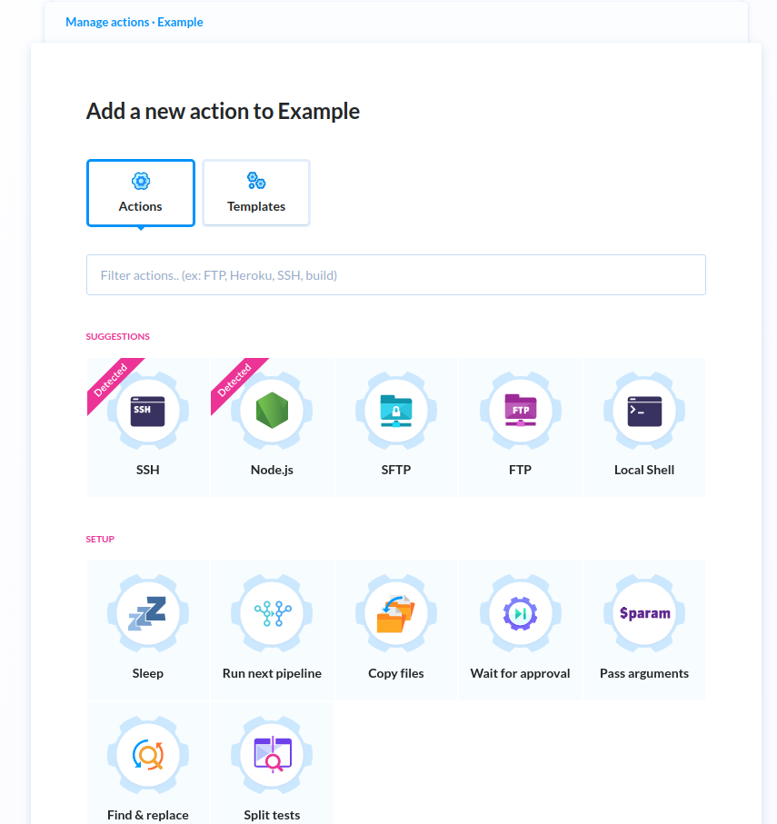
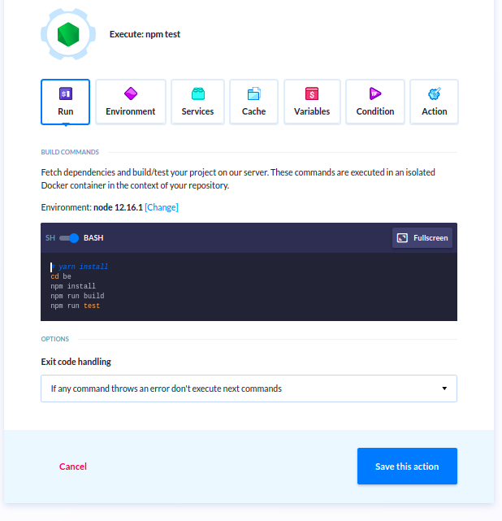
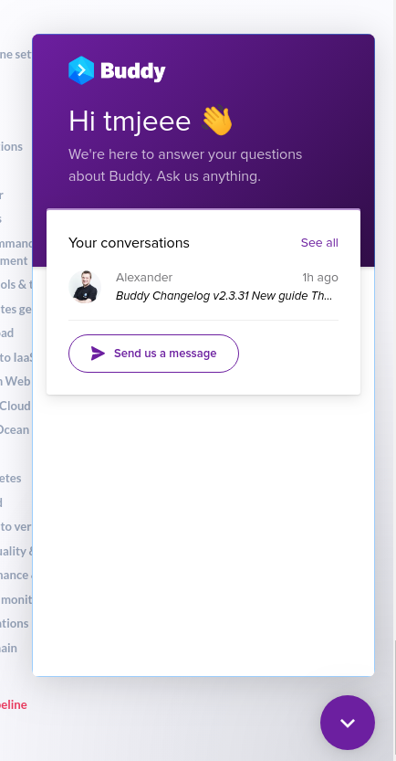

# Article - Buddy CICD SaaS

## Oveview

Buddy is a pretty intuitive Countinuous Integration and Countinuous Deployment \(CICD\) build server providing its offerings as a Software as a Service \(SaaS\). It is very developer friendly which I'm pretty sure you'd find convincing after reading through this article. What DigitalOcean does to Kubernetes is pretty much what Buddy does to CICD, something like "CICD for Dummies" on steriod.

## Pipelines & Actions

The concept of Buddy revolves around pipelines, which to my understanding really means a collection of actions you'd like to run to achieve an overall effect, eg. 

* Download my source code
* Download all of it's dependencies do a build 
* If build is ok, startup the server and run cypress tests
* If successfull, create a docker image
* If susccessfull push docker image to docker hub

Each points would possibly constitues an action

The nice things about Buddy's action is that there are plenty of them. All of them required filling in some texts fileds and then your are done. You will find actions \(docker images\) with cypress ready, kubernetes ready to stuff not limited to DigitalOcean integrations.

If docker environment image you require is not there, it is just one click away to getting your specific environment requested. From experience the Buddy team responsiveness is good, given the stuff I asked about are pretty technical at times.

Or if you are more like a chat person that is also a click away, with a chat icon on the far right bottom.

## How I use Buddy

This section is about how I configure Buddy to suits my own needs. It might not be best practises others agree to but the good side is I find Buddy pretty flexible enough to cater for different situations. I'm saying this as a software developer without much DevOps experience at all, apart from doing some Docker related stuff \(creating image, running them, push and retrieving them from Docker Hub etc.\) and some limited Kubernetes stuff \(deployment of pods, writting simple kubernetes yaml file for demos and development work etc\)

### Grouping of Pipelines

