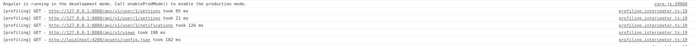

# Dev -FE - Commons

## Directory Structure

```text
+ /src
   + /app/
      + error-handler/                  // Section: Error Handling
        ...
      + guard/                          // Section: Guards
        ...
      + interceptor/                    // Section: Interceptor
        ...
      + utils/                          // Section: Utils
        ...
      + component/
         + shared-component-utils/      // Section: Angular Utils Module
           ...
      - app-materials.module.ts         // Seciton: Angular Materials Module 
```

## Error Handling

Handling of errors throughout the FE including `HttpClient's` XHR calls.

### 401 Unauthorized

Treated as if user is not authenticated, redirects to login page.

### 403 Forbidden

Treated as if user do not have access / role / priviledges to certain functionalities, show popup with error message.

### 404 Not Found

Treated as if APIs end point call not found, show popup with error message.

### 400 Client Error

Treated as if bad inputs / parameters were given to APIs end point calls, show popup with error message.

### Others

Treated as if unknow error has occurred, show popup with error message.

## Guards

#### AuthGuard

Guard against all Angular routes, making sure a user is authenticated before activation of routes.

## Interceptors

### jwt interceptor

Make sure HttpClient's call contains header \(`x-auth-jwt`\) with jwt token in it.

### profiling interceptor

Log in console time taken for HttpClient to make API calls.



## Utils

Contains all static utilities \(not specific to Angular in anyway\)

## Angular Utils Module

An angular module containing all sharable Angular artifacts \(pipe, directives\) that can be made available by just importing this Angular module.

## Angular Materials Module

A convenient Angular modules importing all Angular Material artifacts needed, such that an import of this Angular module in any applicant module will automatically made those Angular materials artifacts available to it.

