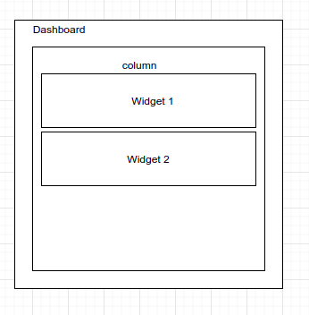
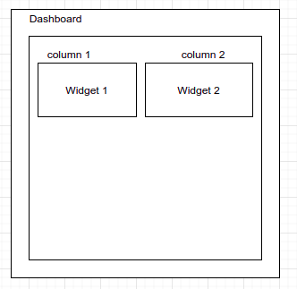

# Dev - FE - Dashboard & Widgets

## Directory Structure

```text
+ src/
   + component/
      + dashboard-component/
         + strategies/
            - dashboard-1x.strategy.ts
            - dashboard-2x.strategy.ts
         + widgets/
            + clock-widget/
               ...
            + stock-trading-widget/
               ...
            + weather-widget/
               ...
```

## Dashboard

Dashboard has 2 properties:

* A strategy that dictates how the dashboard widgets should be layout. It can be a 1 column strategy, which layout dashboard wigets in single column or a 2 columns strategy, which layout dashboard wigets in 2 columns or it can be something entirely different
* A bunch of dashboard wigets that could be dragged and drop on to the dashboard. Each widgets can be created multiple times, eg Widget1 for example can be drop 2 times creating widgets of different instance but all are of Widget1 type.

### Current Available Dashboard Strategies

#### dashboard-1x.strategy.ts

A single column dashboard strategy



#### dashboard-2x.strategy.ts

A 2 columns dashboard strategy



### Creating a new Dashboard Strategy

Create a custom dashboard strategy file with a class that Implements `DashboardStrategy` as follows :

```text
export class MyDashboardStrategy implements DashboardStrategy {

   columnIndexes(): number[] {                                          // (1)
      // return the indexes of columns this strategy has
   
   }
   
   getDashboardWidgetInstancesForColumn(columnIndex: number):            // (2)
         DashboardWidgetInstance[] {
      // return the widget instance for this column index   
   }
   
   addDashboardWidgetInstances(                                          // (3)
         serializeInstanceFormats: 
             SerializeDashboardWidgetInstanceFormat[]) {
      // add this serialized dashboard instance to this 
      // dashboard
   }
   
   removeDashboardWidgetInstances(instanceIds: string[]) {               // (4)
      // remove the given dashbord widget instances identified
      // by the given instance ids
   }
   
   moveDashboardWidgetInstances(columnIndex: number,                     // (5)
        previousIndex: number, currentIndex: number) {
      // move a dashboard widget in this column identified by 
      // the columnIndex, from previous index in this column 
      // (previousIndex) to a new index (currentIndex). This is 
      // basically moving widget in the same column.
   }
   
   transferDashboardWidgetInstances(previousColumnIndex: number,         // (6)
        currentColumnIndex: numbner, previousIndex: number, 
        currentIndex: number) {
      // this is basically moving Widget from a column to a different
      // column, from previousColumnIndex to currentColumnIndex.
      // The widget is in previousIndex in previous column and in 
      // currentIndex in the current column
   }
   
   serialize(): string {                                                 // (7)
      // serialize this dashboard for saving purposes. It should
      // be able to reconstruct the dashboard based on the 
      // return string at later stage
   }
   
   deserialize(data: string) {                                            // (8)
      // deserialize this dashboard from the given serialized data
   }
}
```

#### Point \(1\)

#### Point \(2\)

#### Point \(3\)

#### Point \(4\)

#### Point \(5\)

#### Point \(6\)

#### Point \(7\)

#### Point \(8\)

Place custom dashboard strategy file in `src/component/dashboard-component/strategies` directory.

Register strategy by adding it to `DASHBOARD_STRATEGIES` constant field in  `src/component/dashboard-component/strategies/index.ts` 

```text
export const DASHBOARD_STRATEGIES = [
   ....
   new MyDashboardStrategy()
];
```

### Creating a new Dashboard Widget

Create a custom dashboard widget file with a class that extends `DashboardWidget` as follows :


As this is a normal angular widget, you can implements `OnInit`, `OnDestroy` or any other angular component lifecycle interfaces


```text
@Component({
    templateUrl: './my-widget.component.html',
    styleUrls: ['./my-widget.component.scss']
})
export class MyWidgetComponent extends DashboardWidget {

    static info(): DashboardWidgetInfo {                                // (1)
        return { 
            id: 'my-widget', 
            name: 'my-widget', 
            type: MyWidgetComponent 
        };
    }

    constructor(dashboardWidgetService: DashboardWidgetService,        // (2)
                authService: AuthService) {   
        super(dashboardWidgetService);
    }

    loadClicked() {                                                    // (3)
        this.loadData().pipe((tap(data: DataMap) => {
           // data loaded
        }).subscribe();
    }

    saveClicked() {                                                    // (4)
        const data: DataMap = {
           myData1: 'myDataValue1',
           myData2: 'myDataValue2'
        };
        this.saveData(data).pipe((tap(r: ApiResponse) => {
          if (r.status === 'SUCCESS') {
             // data saved
          }
        }).subscribe();
    }    
}
```

#### Point \(1\)

#### Point \(2\)

#### Point \(3\)

#### Point \(4\)


