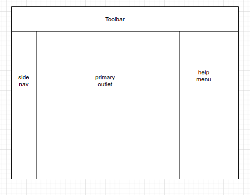
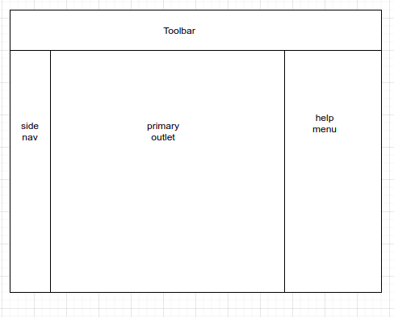
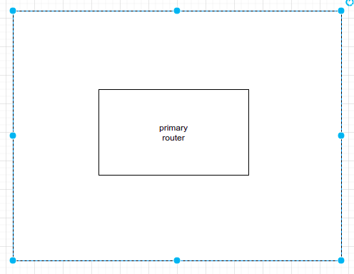
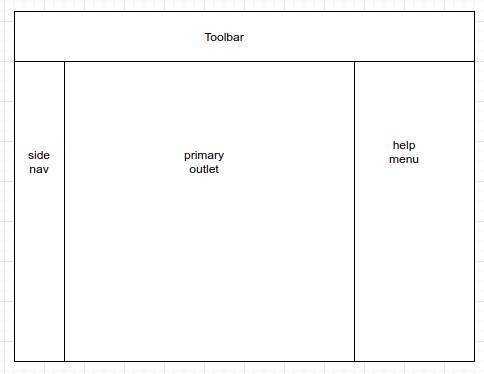
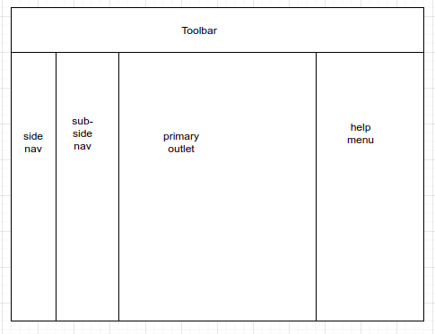
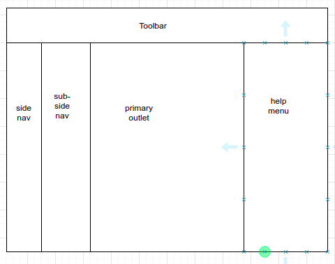

# Dev - FE - Layout

## Directory structure

Following is the directory structure for layouts

```text
+ src/
   + app/
      + layout/
         + dashboard-layout/
            - ...
         + gen-layout/
            - ...
         + import-export-gen-layout/
            - ...
         + login-layout/
            - ...
         + partner-layout/
            - ...
         + user-gen-layout/
            - ...
         + view-gen-layout/
            - ...
```

## Characteristics

* [Layout components](dev-fe-layout.md) are angular components, that decide how `<router-outlet>` are layouted eg. side navigation, sub-side navigation, help menu etc.
* In rare cases it might require services to be injected
* It is the main components wrapping [page components](dev-fe-page.md) which in order wrapped [components](dev-fe-component.md)

### dashboard-layout



| Section | Description |
| :--- | :--- |
| Toolbar |  |
| side nav |  |
| primary outlet |  |
| help menu |  |

### gen-layout



| Section | Description |
| :--- | :--- |
| Toolbar |  |
| side nav |  |
| primary outlet |  |
| help menu |  |

### import-export-gen-layout


| Section | Description |
| :--- | :--- |
| Toolbar |  |
| side nav |  |
| primary outlet |  |
| help menu |  |

### login-layout



| Section | Description |
| :--- | :--- |
| primary router |  |

### partner-layout



| Section | Description |
| :--- | :--- |
| Toolbar |  |
| side nav |  |
| primary outlet |  |
| help menu |  |

### user-gen-layout



| Section | Description |
| :--- | :--- |
| Toolbar |  |
| side nav |  |
| sub-side nav |  |
| primary outlet |  |
| help menu |  |

### view-gen-layout



| Section | Description |
| :--- | :--- |
| Toolbar |  |
| side nav |  |
| sub-side nav |  |
| primary outlet |  |
| help menu |  |

