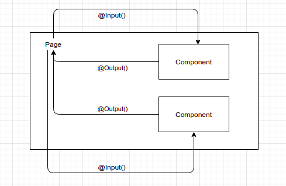

# Dev - FE - Page

## Directory Structure

```text
+ src/
  + page/
     + activate-page/
        ...
     + bulk-edit-help-page/
        ...
     + bulk-edit-page/
     + custom-export-page/
     + custom-import-page/
     + dashboard-help-page/
     + dashboard-page/
     + error-page/
     + export-artifacts-page/
     + export-help-page/
     + file-not-found-page/
     + import-page/
     + import-help-page/
     + jobs-page/
     + login-page/
     + partner-data-list-page/
     ...
```

## Characteristics

* Services a injected to page components
* contains components
* Pass information to components through @Input of ether properties or functions
* Received feedback from components through @Output events
* Smart, in the sense it does all the communications with services
* Not reusable



