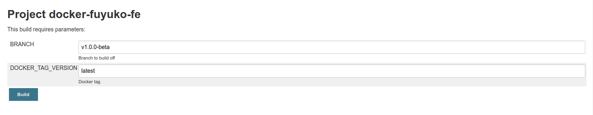
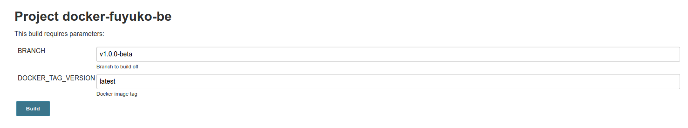
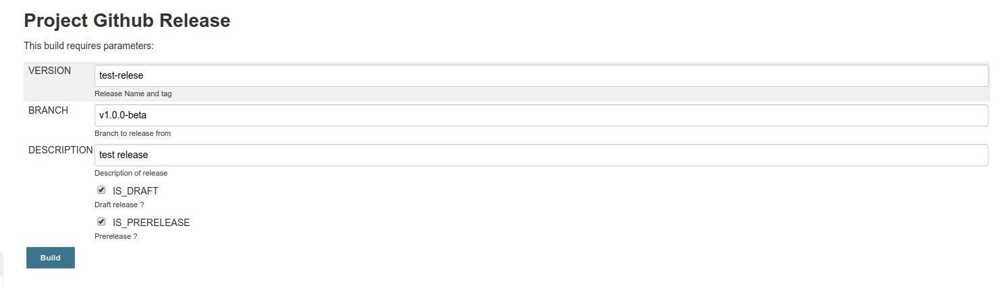

# Dev - Performing a Release

## Step 1: Perform a FE Docker Release

Run Jenkin's `docker-fuyuko-fe` job

Fill in the `branch` and `docker tag version` and roll the build, typically the `branch` and `docker tag version` will be the same for a release.

## Step 2: Perform a BE Docker Release

Run Jenkin's `docker-fuyuko-be` job.

Fill in the `branch` and `docker tag version` and roll the build, typically the `branch` and `docker tag version` will be the same for a release.

## Step 3: Perform a DB Docker Release

Run Jenkin's `docker-fuyuko-db` job.

Fill in the `branch` and `docker tag version` and roll the build, typically the `branch` and `docker tag version` will be the same for a release.

## Step 4: Perform a Github Release

Run Jenkin's `Github Release` job.

Fill in the `branch`, `version`, `description`, `is draft` and `is prerelease` field and roll the build. Typically `branch` and `version` will be the same for a release. Beta releases will have `is draft` false and `is prerelease` true while a proper release will have both `is draft` and `is prerelease` as false.

## Step 5: Merge release branch into master

A manual merge of release branch into master

## Step 6: Create the next release branch from master

Manually create a new release branch from master.

