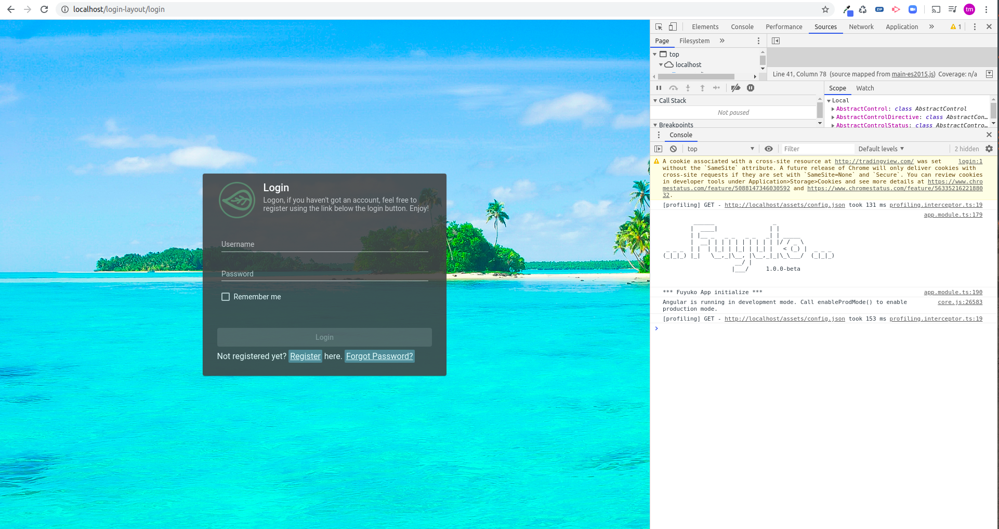

# Docker


This assume that docker is already installed, if not more information can be found in Docker's website [here](https://www.docker.com/).


## Pull Docker images from Docker Hub

Check if you have `tmjee/fuyuko-db` docker image with the correct version using the following command.

```text
docker image ls
```

If you don't have the images \(with the right version\), use the following commands to pull in the appropriate images. Change the version variable appropriately.

Check if docker images are downloaded through the following command:

```text
docker image ls | grep -i fuyuko
```

## Create Docker containers from images

```text
VERSION="v1.0.0-beta"

docker pull tmjee/fuyuko-db:$VERSION
docker pull tmjee/fuyuko-be:$VERSION
docker pull tmjee/fuyuko-be:$VERSION
```

Create Docker containers from the images using the following commands. Change the version variable appopriately.

```text
VERSION="v1.0.0-beta"

docker container create --name tmjee-fuyuko-db --network host tmjee/fuyuko-db:$VERSION
docker container create --name tmjee-fuyuko-be --network host tmjee/fuyuko-be:$VERSION
docker container create --name tmjee-fuyuko-fe --network host tmjee/fuyuko-fe:$VERSION
```

Check the containers created through the following command:

```text
docker container ls --all | grep -i fuyuko
```

## Start Docker containers


You need to start them up in the following order

* `tmjee-docker-db`
* `tmjee-docker-be`
* `tmjee-docker-fe`


### Starting MariaDb 

Start `tmjee-fuyuko-db` container using the following command

```text
docker container start tmjee-fuyuko-db 
```

Check if `tmjee-fuyuko-db` container is started by running

```text
docker container ls | grep -i fuyuko-db
```

Check the logs and see if everything is ok

```text
docker logs -f tmjee-fuyuko-db
```

You should see logs at the end similar to the following 

```text
2020-06-27 13:09:55 0 [Note] InnoDB: 10.4.13 started; log sequence number 60999; transaction id 21
2020-06-27 13:09:55 0 [Note] InnoDB: Loading buffer pool(s) from /var/lib/mysql/ib_buffer_pool
2020-06-27 13:09:55 0 [Note] Plugin 'FEEDBACK' is disabled.
2020-06-27 13:09:55 0 [Note] Server socket created on IP: '::'.
2020-06-27 13:09:55 0 [Note] InnoDB: Buffer pool(s) load completed at 200627 13:09:55
2020-06-27 13:09:55 0 [Warning] 'proxies_priv' entry '@% root@nebuchadnezzar' ignored in --skip-name-resolve mode.
2020-06-27 13:09:55 0 [Note] Reading of all Master_info entries succeeded
2020-06-27 13:09:55 0 [Note] Added new Master_info '' to hash table
2020-06-27 13:09:55 0 [Note] mysqld: ready for connections.
```


Note the `mysqld: ready for connections` indicating the container started up ok at a default port 3306.


To connect to the `tmjee-docker-db` through the following command

```text
mariadb -u root --protocol tcp -p
```

### Start Fuyuko Back-End

Start `tmjee-fuyuko-be` using the following command 

```text
docker container start tmjee-fuyuko-be
```

Check the logs to verify that it started up correctly using the following command

```text
docker logs -f tmjee-fuyuko-be
```

You should see something similar to the following in the logs to indicate that `tmjee-fuyuko-be` has started up correctly 

```text
[06-27-2020 01:10:44 pm] - [<unknown>] - INFO - Created db entry for custom bulk edit script 0.0.2-sample-custom-bulk-edit-2.js
[06-27-2020 01:10:44 pm] - [<unknown>] - INFO - Custom bulk edit script reverse sync, db to files
[06-27-2020 01:10:44 pm] - [<unknown>] - INFO - Db custom bulk edit registry 0.0.1-sample-custom-bulk-edit-1.js is in sync with custom bulk edit script, no action required
[06-27-2020 01:10:44 pm] - [<unknown>] - INFO - Db custom bulk edit registry 0.0.2-sample-custom-bulk-edit-2.js is in sync with custom bulk edit script, no action required
[06-27-2020 01:10:44 pm] - [<unknown>] - INFO - Done custom bulk edit script sync
[06-27-2020 01:10:44 pm] - [<unknown>] - INFO - done with custom bulk edit sync

         ______                 _                 
        |  ____|               | |                
        | |__ _   _ _   _ _   _| | _____          
        |  __| | | | | | | | | | |/ / _ \         
 _ _ _  | |  | |_| | |_| | |_| |   < (_) |  _ _ _ 
(_|_|_) |_|   \__,_|\__, |\__,_|_|\_\___/  (_|_|_)
                     __/ |                        
                    |___/     1.0.0-beta                    
    
    
[06-27-2020 01:10:44 pm] - [<unknown>] - INFO - Fuyuko ready for operation !!!
[06-27-2020 01:10:44 pm] - [<unknown>] - INFO - Fuyuko API started listening at port 8888
```


Note the line `Fuyuko ready for operation` and `Fuyuko API started listing at port 8888` to indicate that it has started up correctly.


### Start Fuyuko Front-End

Start `tmjee-fuyuko-fe` using the following command

```text
docker container start tmjee-fuyuko-fe
```

Check the logs to verify that it started up correctly using the following command

```text
docker logs -f tmjee-fuyuko-fe
```

You should see something like the followings

```text
**************** Fuyuko FE *************************
****************************************************
```

Hit `tmjee-fuyuko-fe` in a browser at `http://localhost` 

The logs should start rolling 

```text
127.0.0.1 - - [27/Jun/2020:14:00:10 +0000] "GET / HTTP/1.1" 200 1831 "-" "Mozilla/5.0 (X11; Linux x86_64) AppleWebKit/537.36 (KHTML, like Gecko) Chrome/81.0.4044.138 Safari/537.36" "-"
127.0.0.1 - - [27/Jun/2020:14:00:10 +0000] "GET /runtime-es2015.js HTTP/1.1" 200 6306 "http://localhost/" "Mozilla/5.0 (X11; Linux x86_64) AppleWebKit/537.36 (KHTML, like Gecko) Chrome/81.0.4044.138 Safari/537.36" "-"
127.0.0.1 - - [27/Jun/2020:14:00:10 +0000] "GET /polyfills-es2015.js HTTP/1.1" 200 144853 "http://localhost/" "Mozilla/5.0 (X11; Linux x86_64) AppleWebKit/537.36 (KHTML, like Gecko) Chrome/81.0.4044.138 Safari/537.36" "-"
127.0.0.1 - - [27/Jun/2020:14:00:10 +0000] "GET /styles-es2015.js HTTP/1.1" 200 1547220 "http://localhost/" "Mozilla/5.0 (X11; Linux x86_64) AppleWebKit/537.36 (KHTML, like Gecko) Chrome/81.0.4044.138 Safari/537.36" "-"
127.0.0.1 - - [27/Jun/2020:14:00:10 +0000] "GET /vendor-es2015.js HTTP/1.1" 200 7545872 "http://localhost/" "Mozilla/5.0 (X11; Linux x86_64) AppleWebKit/537.36 (KHTML, like Gecko) Chrome/81.0.4044.138 Safari/537.36" "-"
127.0.0.1 - - [27/Jun/2020:14:00:10 +0000] "GET /assets/images/logo/fuyuko-logo-with-side-wordings.png HTTP/1.1" 200 95386 "http://localhost/" "Mozilla/5.0 (X11; Linux x86_64) AppleWebKit/537.36 (KHTML, like Gecko) Chrome/81.0.4044.138 Safari/537.36" "-"
127.0.0.1 - - [27/Jun/2020:14:00:10 +0000] "GET /assets/images/loading-animation/Bars-1s-200px.svg HTTP/1.1" 200 1351 "http://localhost/" "Mozilla/5.0 (X11; Linux x86_64) AppleWebKit/537.36 (KHTML, like Gecko) Chrome/81.0.4044.138 Safari/537.36" "-"
127.0.0.1 - - [27/Jun/2020:14:00:10 +0000] "GET /assets/images/loading-animation/Vanilla-1s-277px.svg HTTP/1.1" 200 11780 "http://localhost/" "Mozilla/5.0 (X11; Linux x86_64) AppleWebKit/537.36 (KHTML, like Gecko) Chrome/81.0.4044.138 Safari/537.36" "-"
127.0.0.1 - - [27/Jun/2020:14:00:10 +0000] "GET /main-es2015.js HTTP/1.1" 200 5003552 "http://localhost/" "Mozilla/5.0 (X11; Linux x86_64) AppleWebKit/537.36 (KHTML, like Gecko) Chrome/81.0.4044.138 Safari/537.36" "-"
127.0.0.1 - - [27/Jun/2020:14:00:11 +0000] "GET /assets/config.json HTTP/1.1" 200 80 "http://localhost/" "Mozilla/5.0 (X11; Linux x86_64) AppleWebKit/537.36 (KHTML, like Gecko) Chrome/81.0.4044.138 Safari/537.36" "-"
127.0.0.1 - - [27/Jun/2020:14:00:11 +0000] "GET /assets/images/logo/fuyuko-logo.png HTTP/1.1" 200 140097 "http://localhost/login-layout/login" "Mozilla/5.0 (X11; Linux x86_64) AppleWebKit/537.36 (KHTML, like Gecko) Chrome/81.0.4044.138 Safari/537.36" "-"
127.0.0.1 - - [27/Jun/2020:14:00:11 +0000] "GET /assets/images/login-background/background-01.jpg HTTP/1.1" 200 283351 "http://localhost/login-layout/login" "Mozilla/5.0 (X11; Linux x86_64) AppleWebKit/537.36 (KHTML, like Gecko) Chrome/81.0.4044.138 Safari/537.36" "-"
127.0.0.1 - - [27/Jun/2020:14:00:11 +0000] "GET /assets/images/login-background/background-02.jpg HTTP/1.1" 200 314208 "http://localhost/login-layout/login" "Mozilla/5.0 (X11; Linux x86_64) AppleWebKit/537.36 (KHTML, like Gecko) Chrome/81.0.4044.138 Safari/537.36" "-"
127.0.0.1 - - [27/Jun/2020:14:00:11 +0000] "GET /assets/images/login-background/background-03.jpg HTTP/1.1" 200 410930 "http://localhost/login-layout/login" "Mozilla/5.0 (X11; Linux x86_64) AppleWebKit/537.36 (KHTML, like Gecko) Chrome/81.0.4044.138 Safari/537.36" "-"
127.0.0.1 - - [27/Jun/2020:14:00:11 +0000] "GET /assets/images/login-background/background-04.jpg HTTP/1.1" 200 992461 "http://localhost/login-layout/login" "Mozilla/5.0 (X11; Linux x86_64) AppleWebKit/537.36 (KHTML, like Gecko) Chrome/81.0.4044.138 Safari/537.36" "-"
127.0.0.1 - - [27/Jun/2020:14:00:11 +0000] "GET /assets/images/login-background/background-05.jpg HTTP/1.1" 200 302505 "http://localhost/login-layout/login" "Mozilla/5.0 (X11; Linux x86_64) AppleWebKit/537.36 (KHTML, like Gecko) Chrome/81.0.4044.138 Safari/537.36" "-"
127.0.0.1 - - [27/Jun/2020:14:00:11 +0000] "GET /favicon.ico HTTP/1.1" 200 115304 "http://localhost/login-layout/login" "Mozilla/5.0 (X11; Linux x86_64) AppleWebKit/537.36 (KHTML, like Gecko) Chrome/81.0.4044.138 Safari/537.36" "-"
127.0.0.1 - - [27/Jun/2020:14:00:11 +0000] "GET /assets/images/login-background/background-06.jpg HTTP/1.1" 200 490808 "http://localhost/login-layout/login" "Mozilla/5.0 (X11; Linux x86_64) AppleWebKit/537.36 (KHTML, like Gecko) Chrome/81.0.4044.138 Safari/537.36" "-"
127.0.0.1 - - [27/Jun/2020:14:00:11 +0000] "GET /assets/images/login-background/background-07.jpg HTTP/1.1" 200 1795386 "http://localhost/login-layout/login" "Mozilla/5.0 (X11; Linux x86_64) AppleWebKit/537.36 (KHTML, like Gecko) Chrome/81.0.4044.138 Safari/537.36" "-"
127.0.0.1 - - [27/Jun/2020:14:00:11 +0000] "GET /assets/images/login-background/background-08.jpg HTTP/1.1" 200 2304202 "http://localhost/login-layout/login" "Mozilla/5.0 (X11; Linux x86_64) AppleWebKit/537.36 (KHTML, like Gecko) Chrome/81.0.4044.138 Safari/537.36" "-"
127.0.0.1 - - [27/Jun/2020:14:00:11 +0000] "GET /assets/images/login-background/background-09.jpg HTTP/1.1" 200 826378 "http://localhost/login-layout/login" "Mozilla/5.0 (X11; Linux x86_64) AppleWebKit/537.36 (KHTML, like Gecko) Chrome/81.0.4044.138 Safari/537.36" "-"
127.0.0.1 - - [27/Jun/2020:14:00:11 +0000] "GET /assets/images/login-background/background-10.jpg HTTP/1.1" 200 1496129 "http://localhost/login-layout/login" "Mozilla/5.0 (X11; Linux x86_64) AppleWebKit/537.36 (KHTML, like Gecko) Chrome/81.0.4044.138 Safari/537.36" "-"
127.0.0.1 - - [27/Jun/2020:14:00:11 +0000] "GET /assets/images/login-background/background-11.jpg HTTP/1.1" 200 415620 "http://localhost/login-layout/login" "Mozilla/5.0 (X11; Linux x86_64) AppleWebKit/537.36 (KHTML, like Gecko) Chrome/81.0.4044.138 Safari/537.36" "-"
```

The browser should show something like the followings with developer console open up.



## Stop Docker containers

### Stop Fuyuko Db

To stop `tmjee-fuyuko-db` use the following command

```text
docker container stop tmjee-fuyuko-db
```

### Stop Fuyuko Back-End

To stop `tmjee-fuyuko-be` use the following command

```text
docker container stop tmjee-fuyuko-be
```

### Stop Fuyuko Front-End

To stop `tmjee-fuyuko-fe` use the following command

```text
docker container stop tmjee-fuyuko-fe
```


