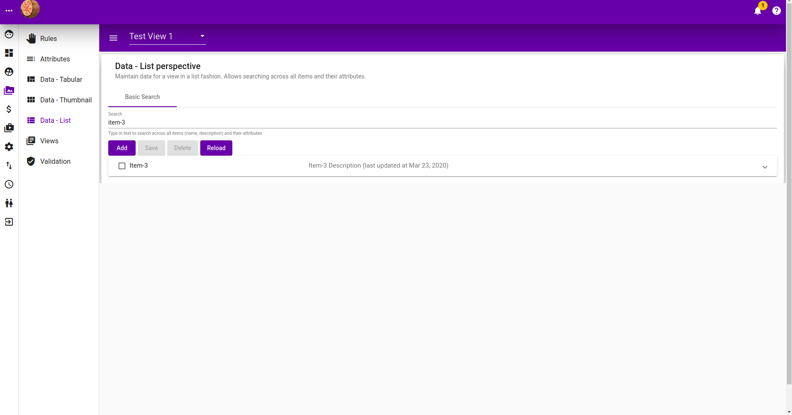
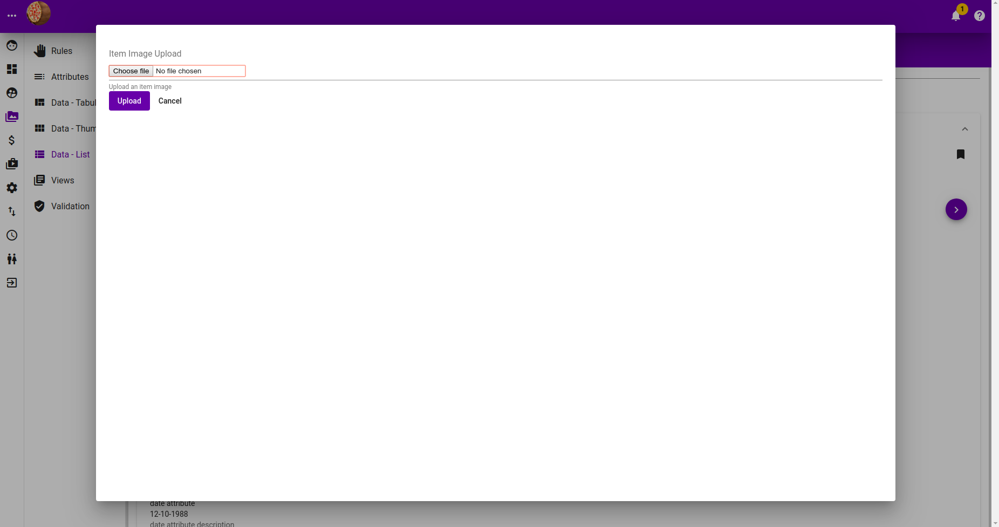
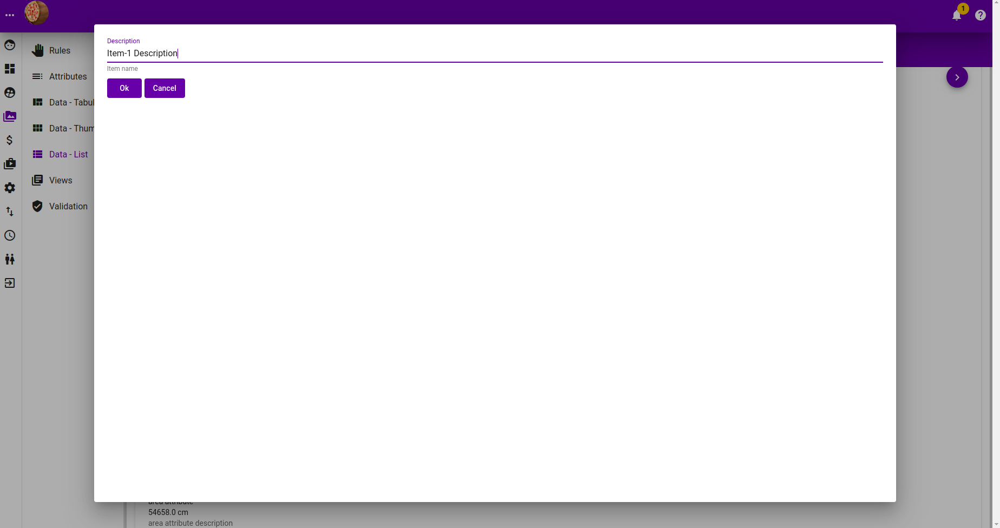
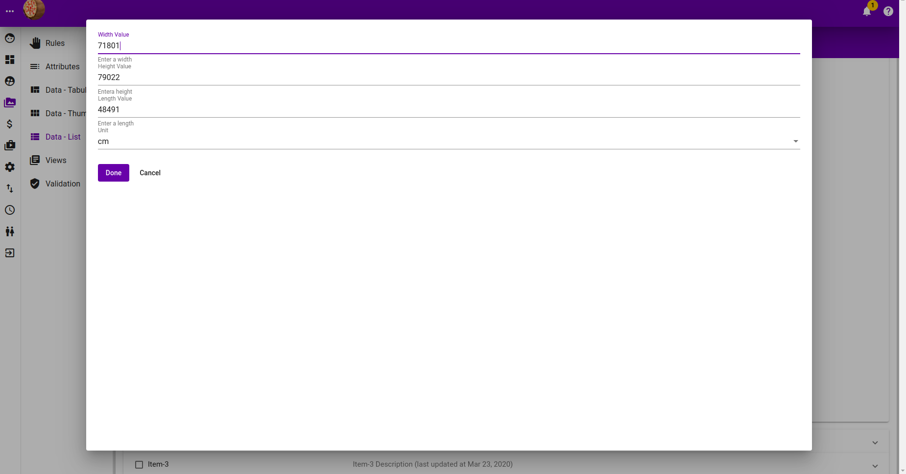
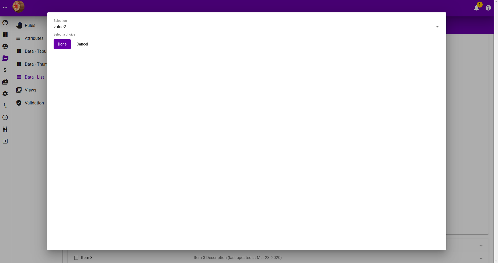

# Item - List

## Listing

## Listing  with item expanded

## Search

## Add new Item

## Add New Item Image

## Edit Item Name

## Edit Item Description

## Edit Item String Attribute

## Edit Item Text Attribute

## Edit Item Number Attribute

## Edit Item Currency Attribute

## Edit Item Date Attribute

## Edit Item Area Attribute

## Edit Item Dimension Attribute

## Edit Item Volume Attribute

## Edit Item Length Attribute

## Edit Item Width Attribute

## Edit Item Height Attribute

## Edit Item Select Attribute

## Edit Item Double Select Attribute

