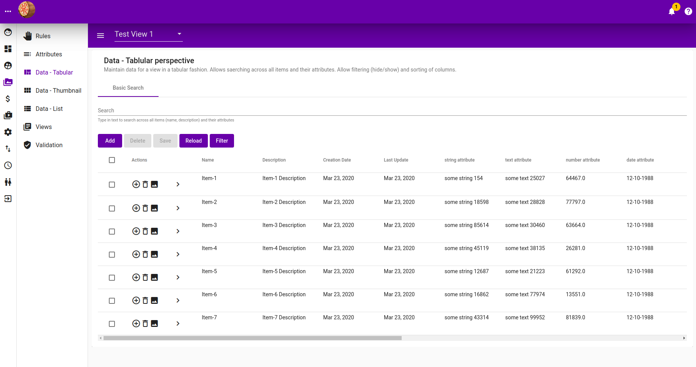
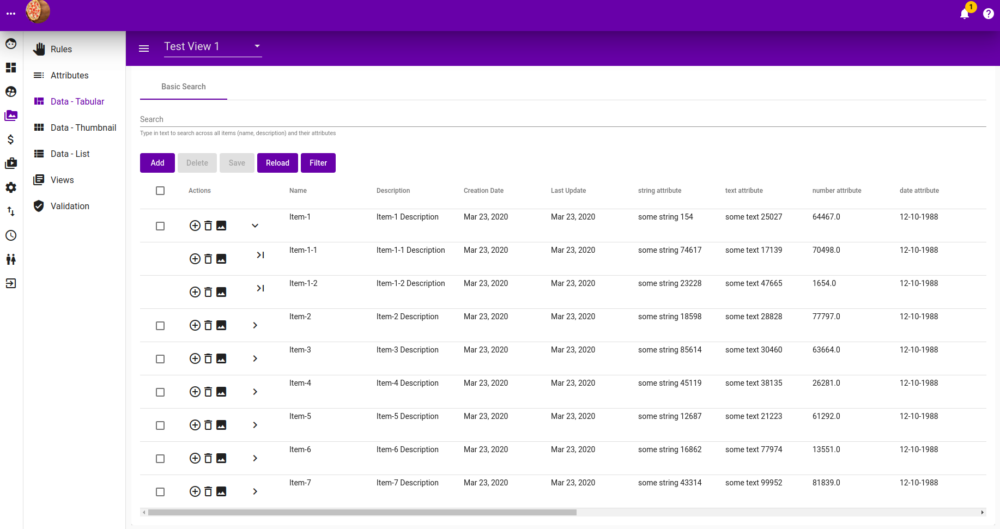
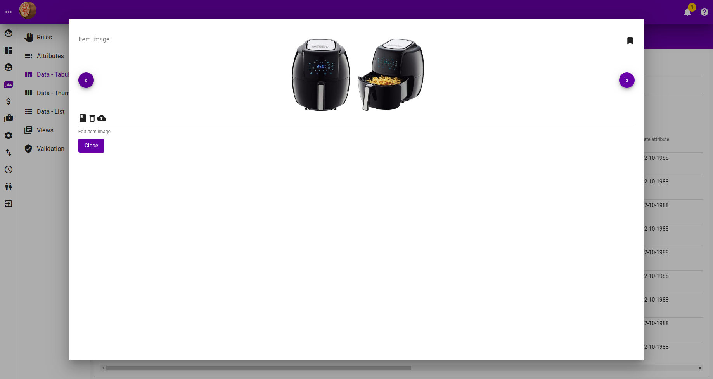
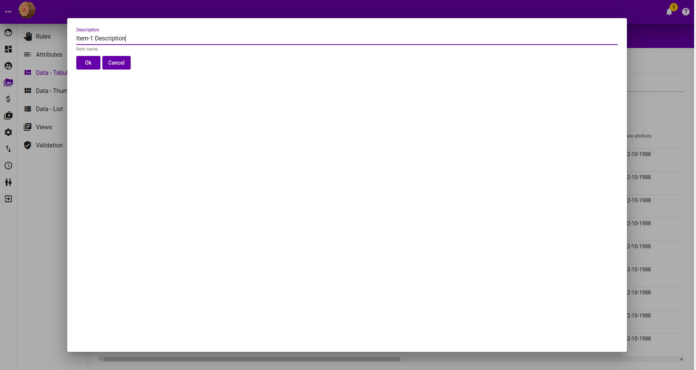
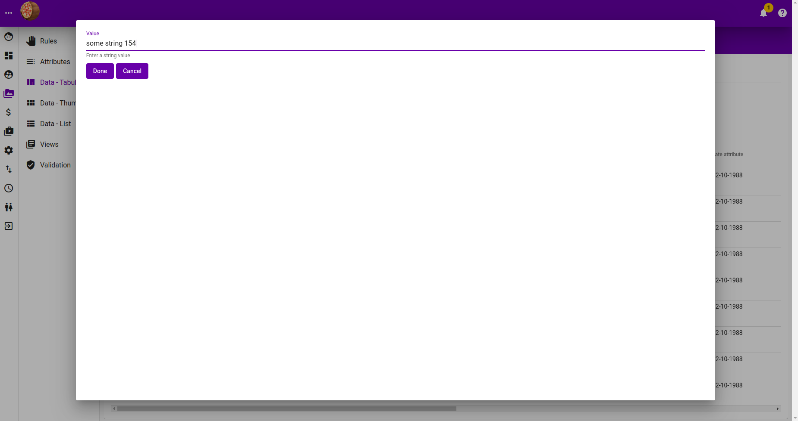
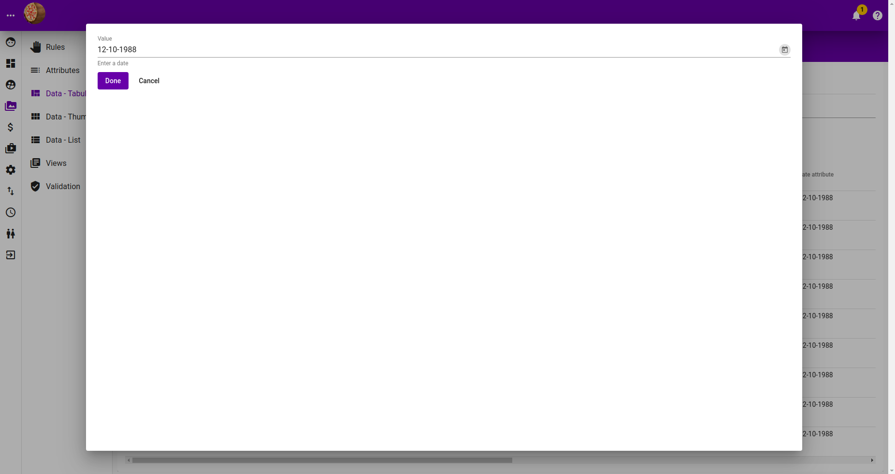
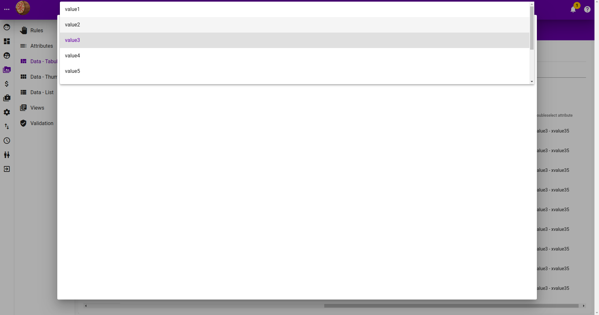
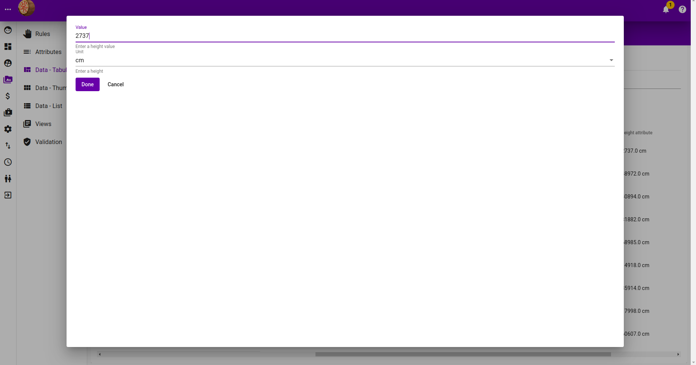
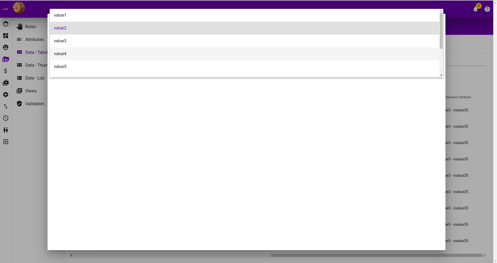

# Item - Tabular

## Tabular

### Listing

### Listing with children expanded

### Filtering

### Adding New Items

### Edit Item Image

### Edit Item Name

### Edit Item Description

### Edit Item String Attribute Value

### Edit Item Text Attribute Value

### Edit Item Number Attribute Value

### Edit Item Area Attribute Value

### Edit Item Currency Attribute Value

### Edit Item Date Attribute Value

### Edit Item Dimension Attribute Value

### Edit Item Double Select Attribute Value

### Edit Item Height Attribute Value

### Edit Item Length Attribute Value

### Edit Item Select Attribute Value

### Edit Item Volume Attribute Value

### Edit Item Width Attribute Value

## Thumbnail

