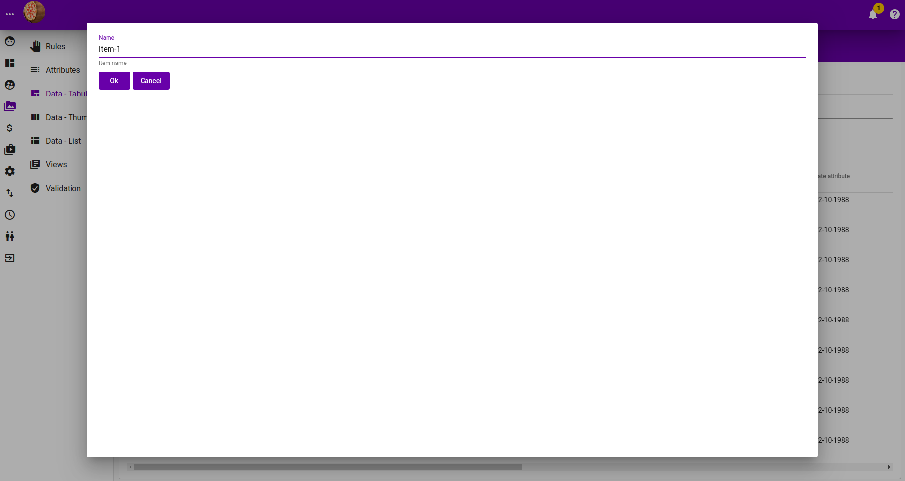
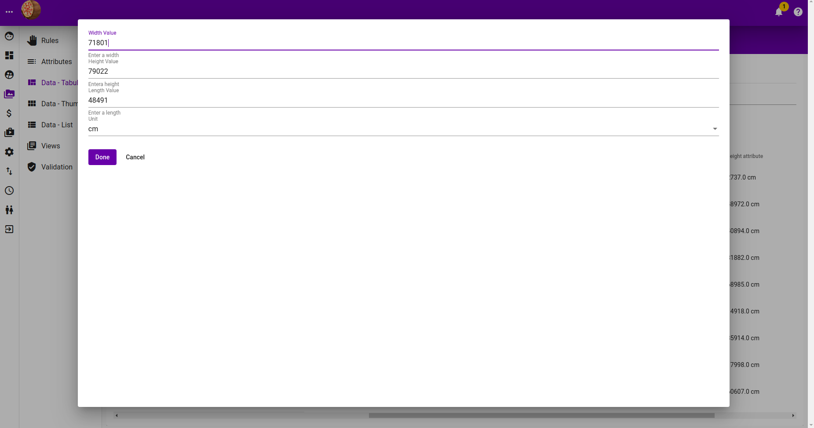
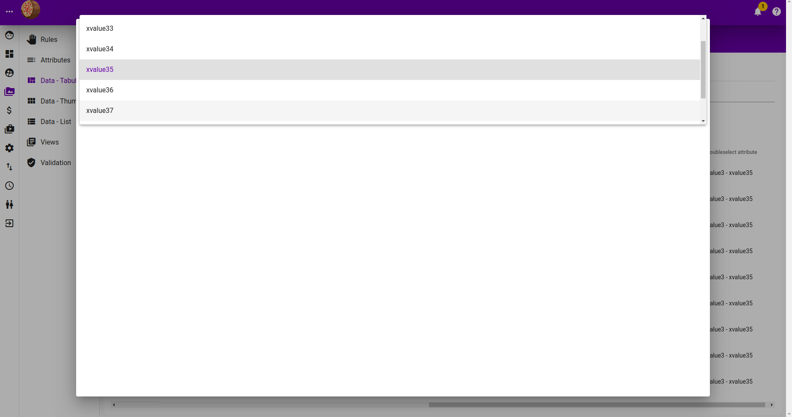
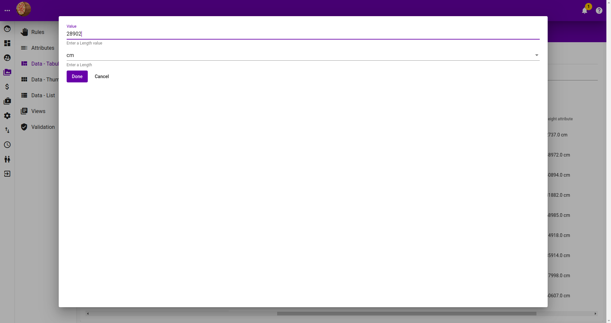
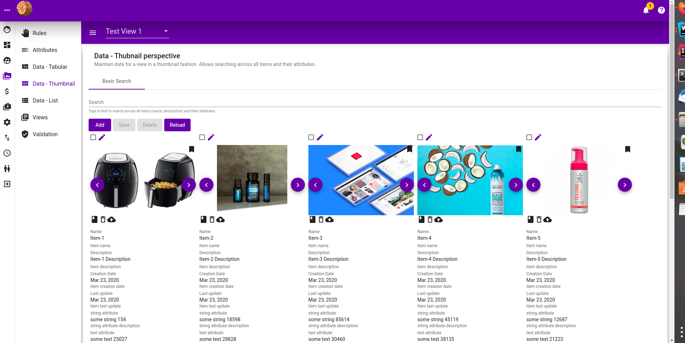
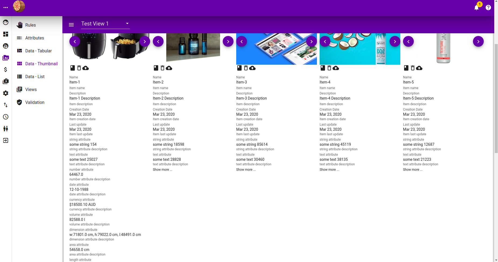
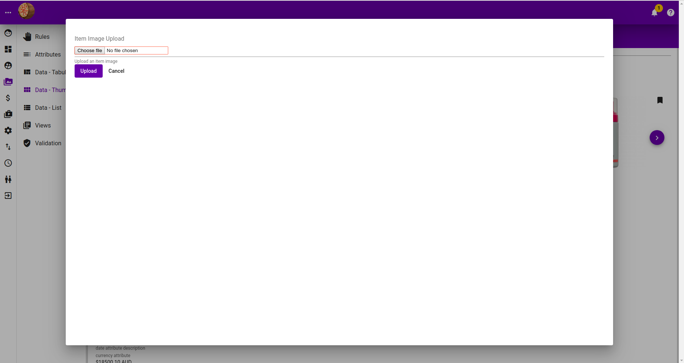
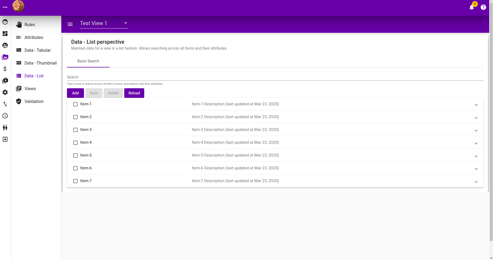
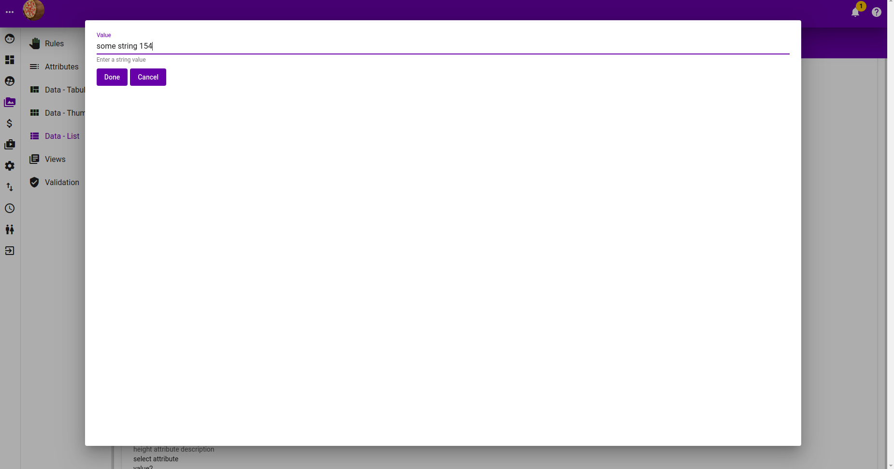
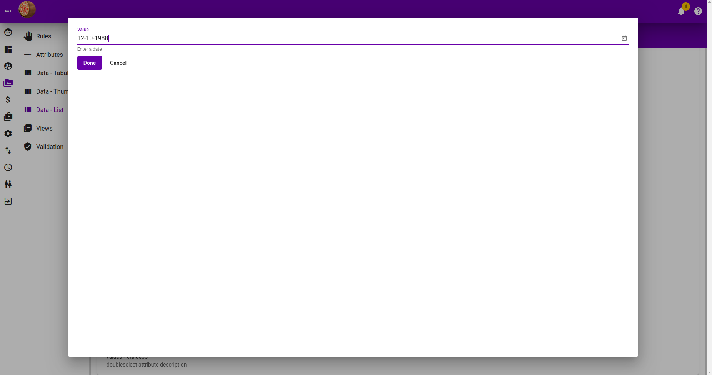

# Item

## Tabular

### Listing

### Listing with children expanded

### Filtering

### Adding New Items

### Edit Item Image

### Edit Item Name

### Edit Item Description

### Edit Item String Attribute Value

### Edit Item Text Attribute Value

### Edit Item Number Attribute Value

### Edit Item Area Attribute Value

### Edit Item Currency Attribute Value

### Edit Item Date Attribute Value

### Edit Item Dimension Attribute Value

### Edit Item Double Select Attribute Value

### Edit Item Height Attribute Value

### Edit Item Length Attribute Value

### Edit Item Select Attribute Value

### Edit Item Volume Attribute Value

### Edit Item Width Attribute Value

## Thumbnail

### Listing

### Expand Item in listing

### Search

### Add new Item

### Edit Item Image

## List

### Listing

### Listing  with item expanded

### Search

### Add new Item

### Add New Item Image

### Edit Item Name

### Edit Item Description

### Edit Item String Attribute

### Edit Item Text Attribute

### Edit Item Number Attribute

### Edit Item Currency Attribute

### Edit Item Date Attribute

### Edit Item Area Attribute

### Edit Item Dimension Attribute

### Edit Item Volume Attribute

### Edit Item Length Attribute

### Edit Item Width Attribute

### Edit Item Height Attribute

### Edit Item Select Attribute

### Edit Item Double Select Attribute

