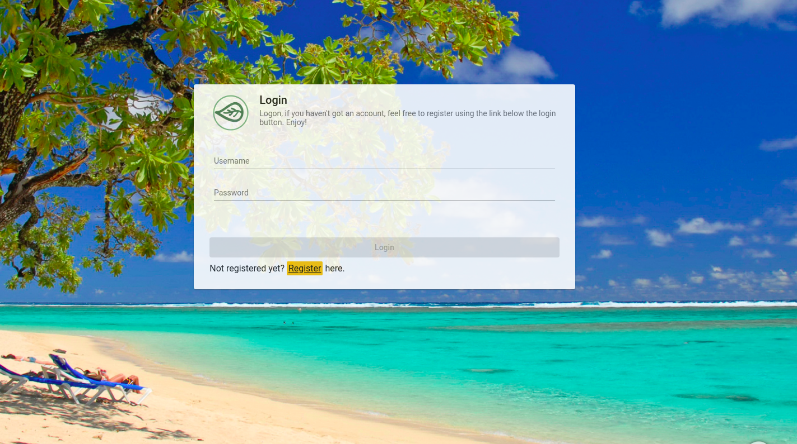

# Log In

Navigate to the login page `http://<host>:<port>/login-layout/login`and you would see the following screen, though the background image might varies. Default user with all priviledges would be `root` with password `test`. Upon login, you'd be sent to the [Dashboard page](dashboard.md)

