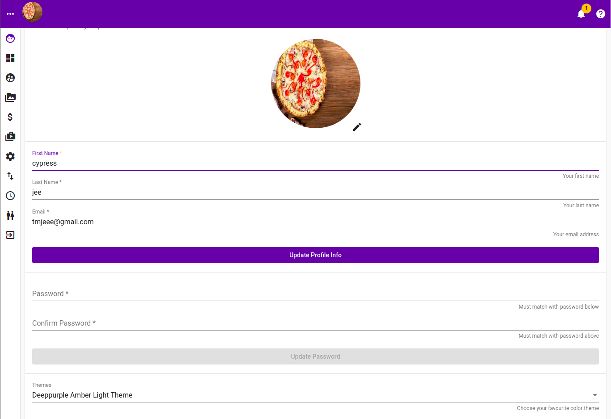
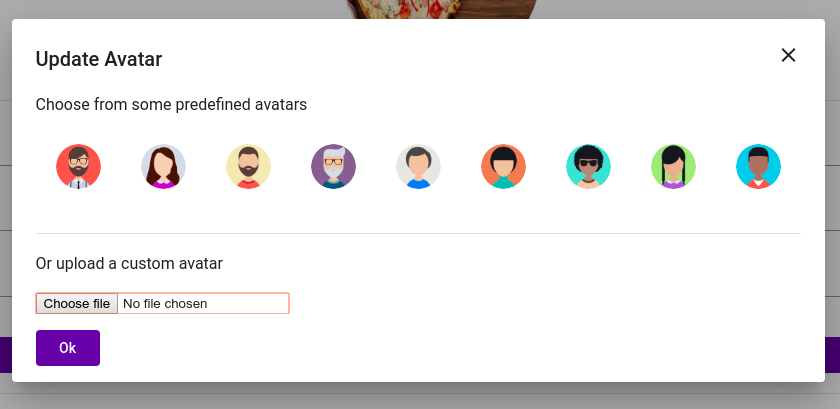
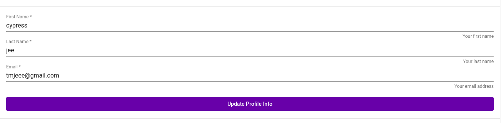
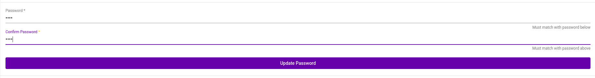
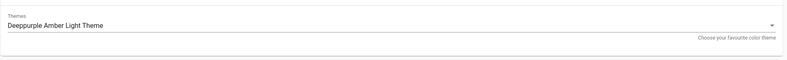
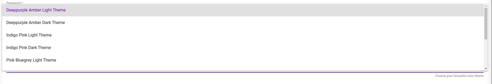
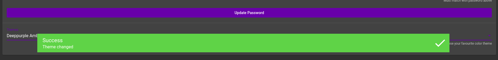

# Profile

The profile page looks somewhat like the follwoing

is where a user configure his preferences / details 

* change of avatar
* change of name
* change of email
* change of password
* change of theme

### Change of Avatar

Click on pencil icon

### Change of Name and Email

### Change of Password

### Change of Theme

Upon changing theme a success message will popup

