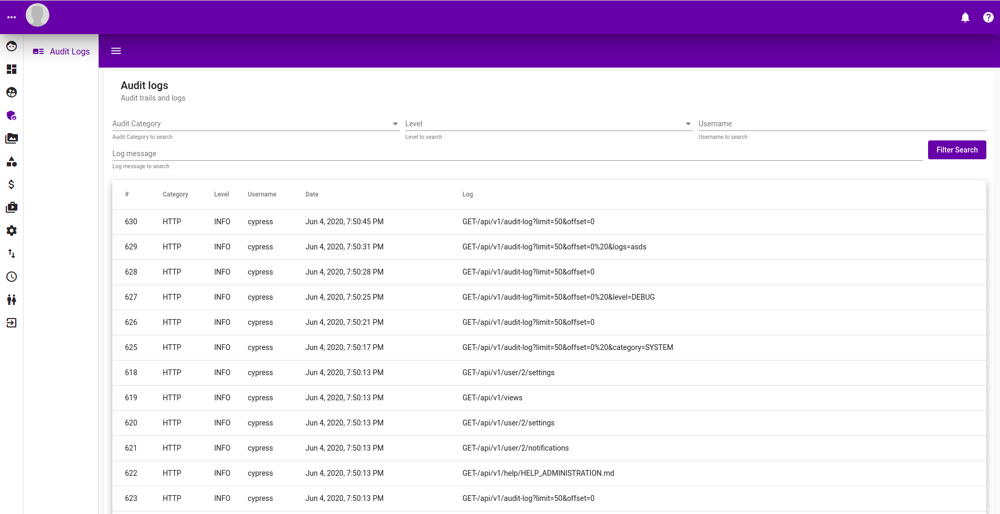
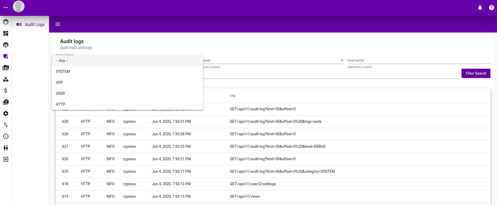
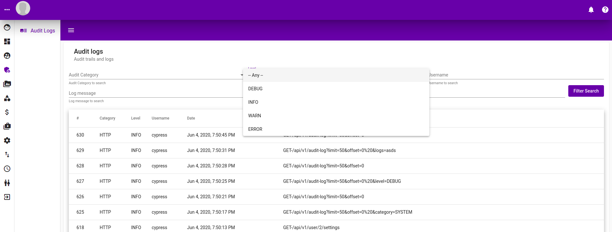
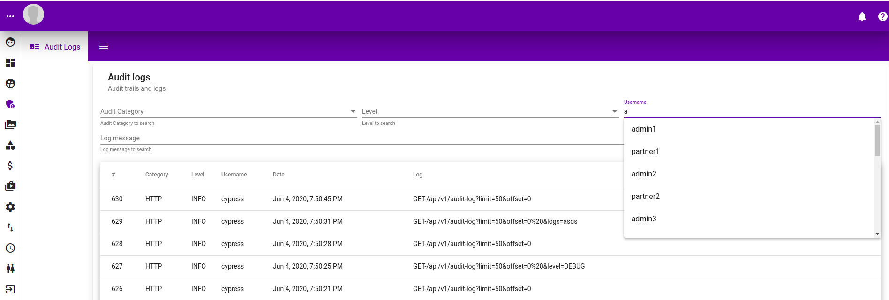
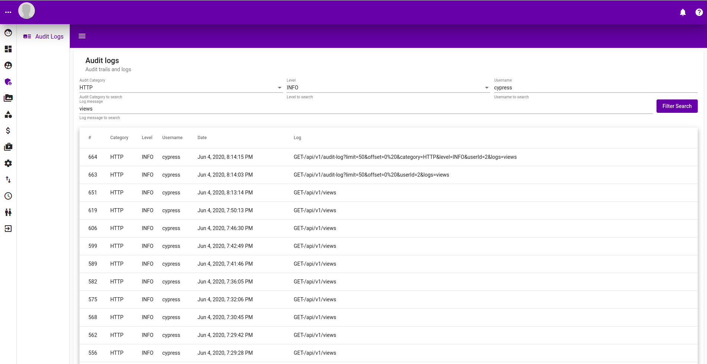
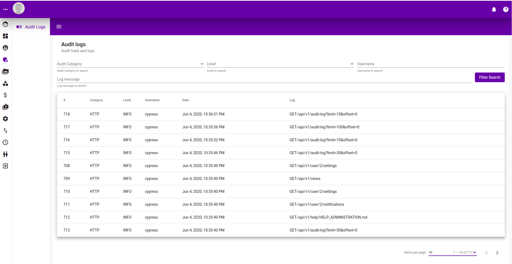

# Audit Logs

## Listing

Following is the listing of audit logs recorded in the system. It orders by descending date.

## Filtering By Category

Audit logs can be filtered by category as show below.

## Filtering by Level

Audit logs can be filtered by leve as shown below.

## Filtering by User

Audit log can be filtered by user as well.

## Filtering search

Following is a search result of audit logs filtered by Category, Level, User and log message.

## Pagination

Pagination is also possible as shown below

