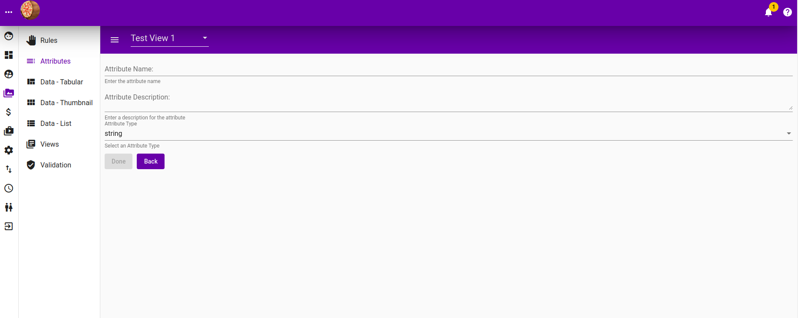
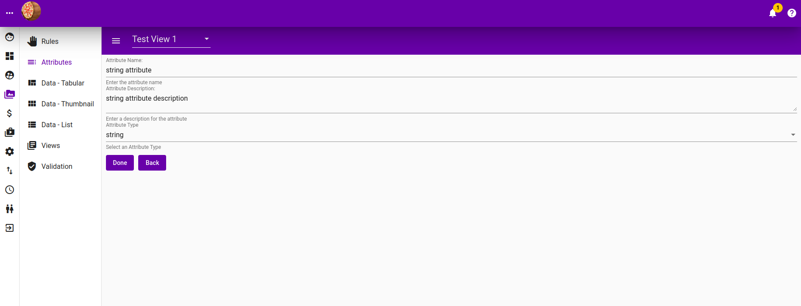

# Attributes

## Listing

This list down hte attributes within a view, where the view is selectable from the view drop down at the top.

## Search for attribute

Filter out attributes by typing into "Search attributes" text field. 


"Search attributes" text field is not auto-complete capable, you will need to press enter for it to perform filtering and show the filtered result in the table.

To clear filter, simply emptied the "Search attributes" text field and press enter.

The icons on the far right of the table with a "pen" followed by a "cross" is for editing and deleting that attribute respectively.


## Add attribute

Clicking on the "Add Attribute" button, will take you to the following screen where you add attribute.

## Edit existing attribute

Clicking on the "pen" icon on the far right of the attribute listing table will bring up the following screen allowing you to edit an existing attribute.

