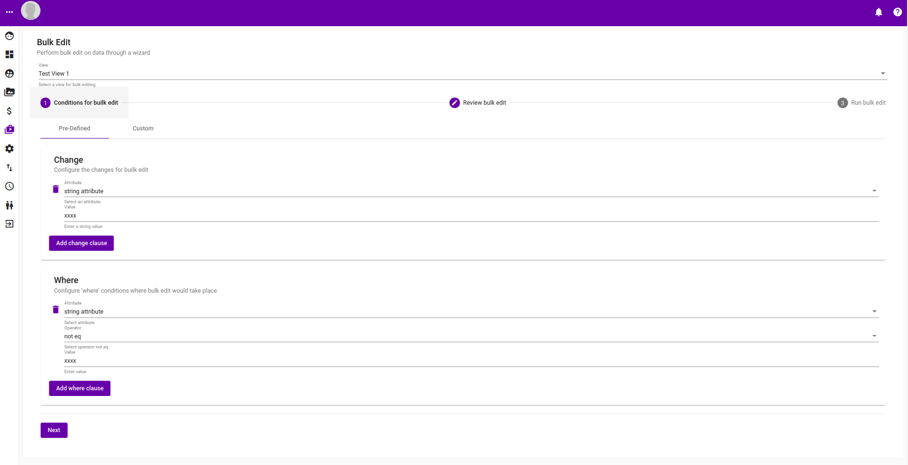
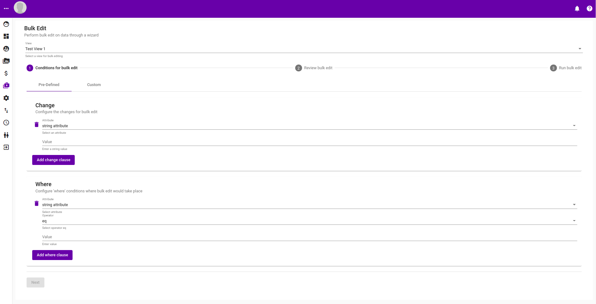
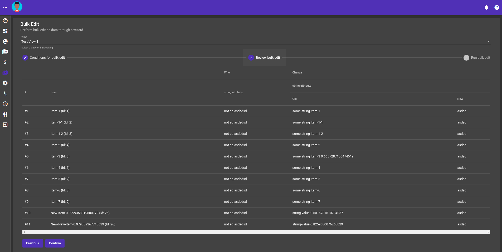
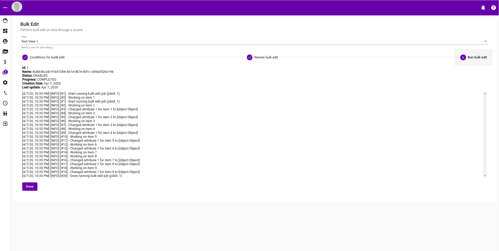

# Bulk Edit

## Predefined

Predefined bulk edit is where the application has a wizard that walks you through gathering information on the conditions a bulk edit should be perform before executing it. For more use case specific ones a custom bulk edit can be performed.

### Wizard Step 1:  Conditions

This involves gathering where the bulk edit change should occurred \(which attribute etc.\) and what attributes and their values should be changed.

### Wizard Step 2: Review

This step involves giving user a review of what will be changed before performing the change itself.

### Wizard Step 3: Run

This step will schedule the bulk edit together with a rolling log of what happened at the back end.

## Custom


Not implemented yet !!!


