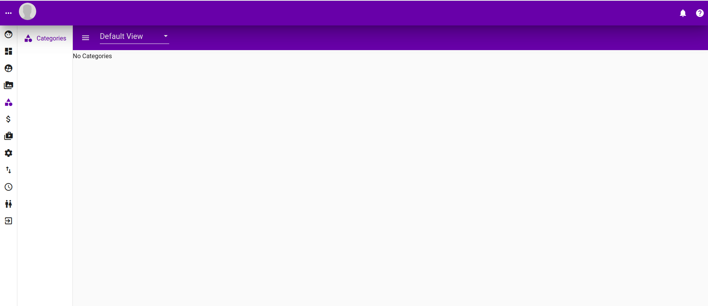
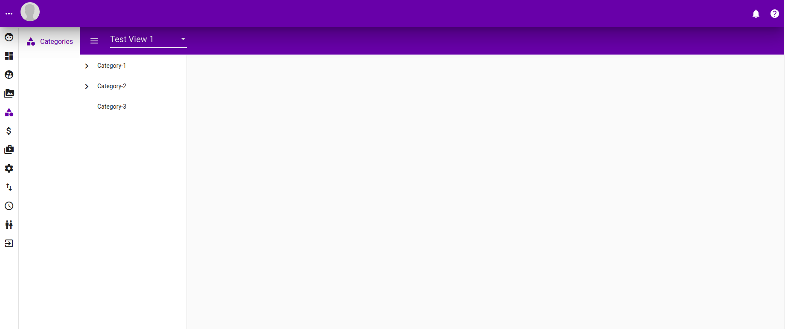
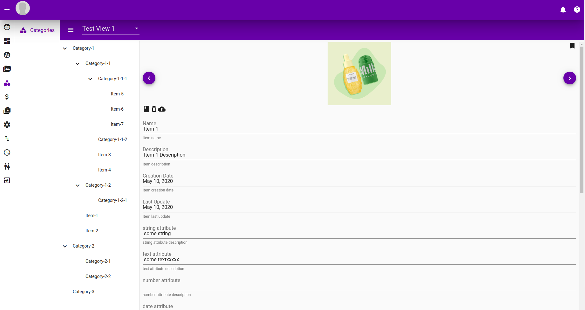

# Category

Category is a way to group items into categories. Following are its characteristics

* Categories are nestable. It can has children and grandchildren and so on.
* Items can be linked to category. 
* Similar items can be linked to multiple category \(event in category that are nested\)

### Listing Page

This is the category main page. When there are no category defined a "No Categories" message would show.

### Categories in view

Following show how it looks like when a view has categories.

### Category selected

When a category is clicked, the right hand side would show the items in the selected category.

### Items selected

When an item is selected in the tree, the item information and attributes will be shown on the right hand side.

