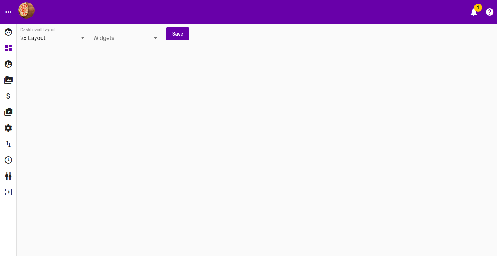
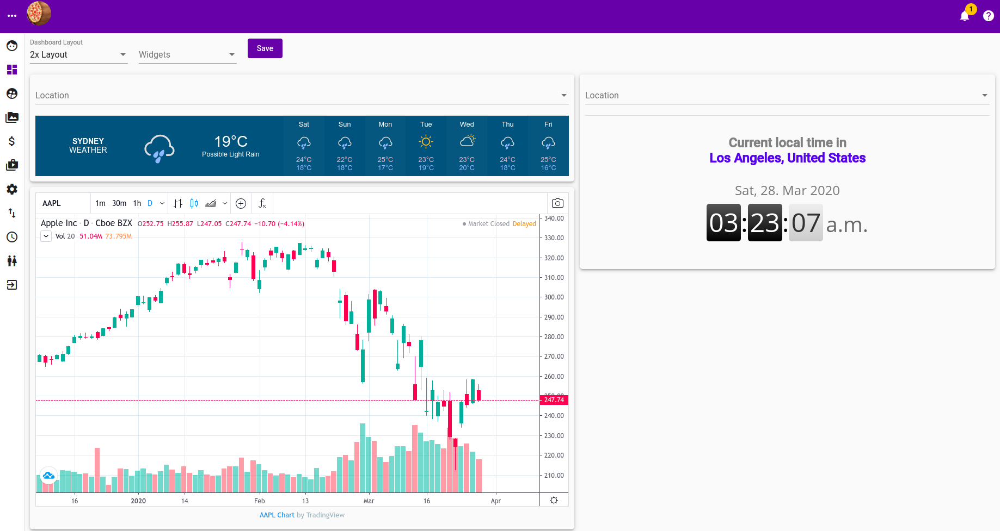
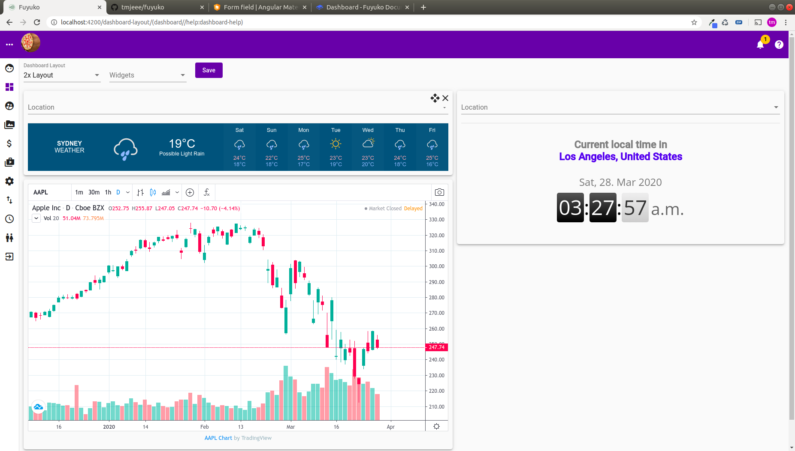
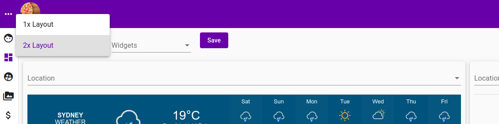
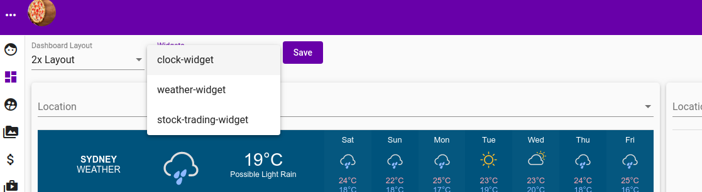
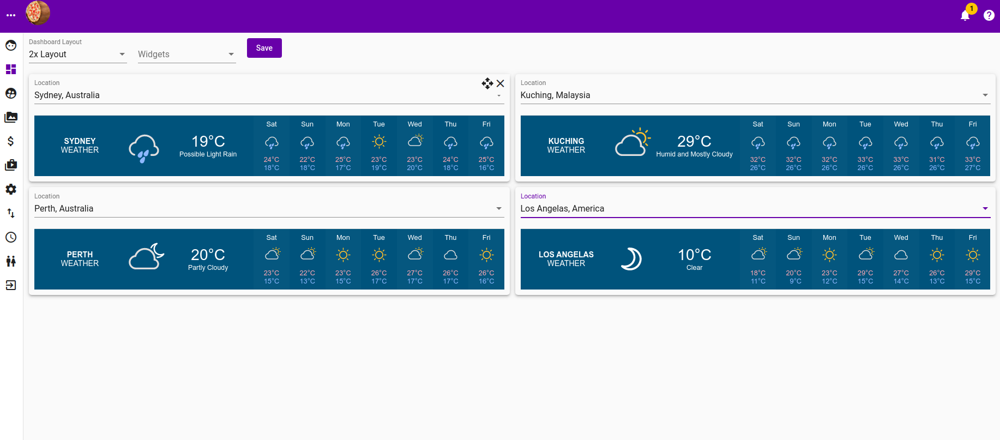

# Dashboard

Dashboard page typically looks like the following

## Dashboard with widgets populated

## Dashboard with drag and remove icon presents when hover across widget

## Dashboard layout selection

## Dashboard widget selection

## Dashboard with multiple instances of same widget

