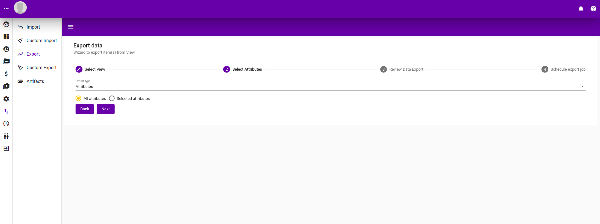
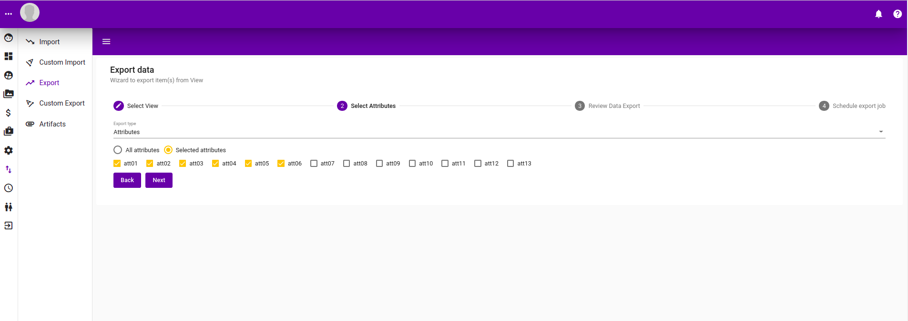
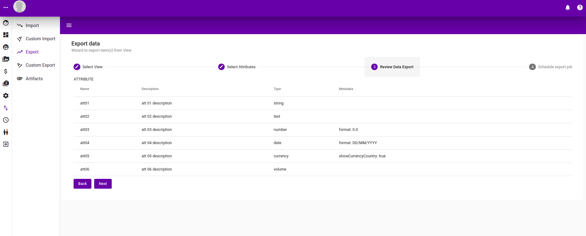
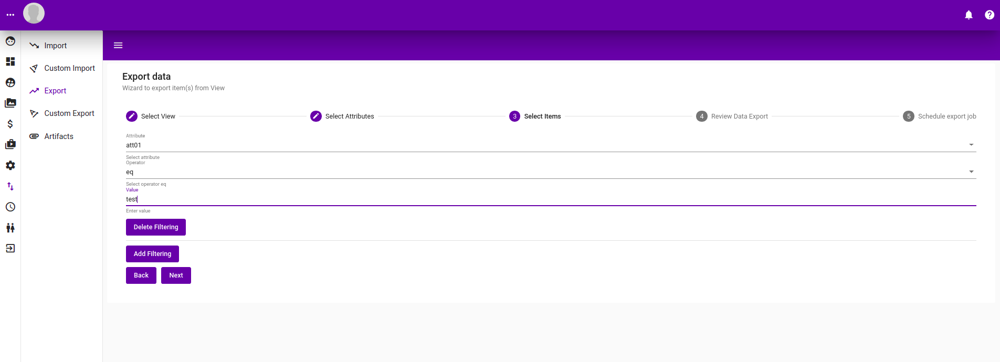
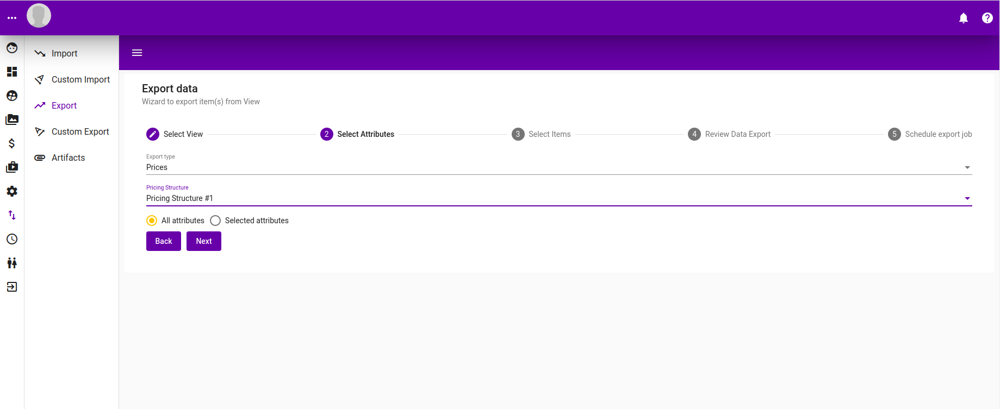
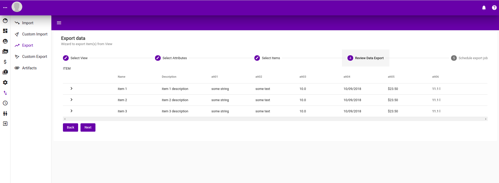

# Export

## Build In Export


Successful export appears as an artifact. See [here](artifacts.md) for more information about export artifacts.


### Output format \(csv\) of Attribute Export

Following is a sample of a typical attribute export in csv format.

```text
"name","description","type","format","showCurrencyCountry","pair1","pair2"
"string attribute","string attribute description","string",,,"",""
"text attribute","text attribute description","text",,,"",""
"number attribute","number attribute description","number","0.0",,"",""
"date attribute","date attribute description","date","DD-MM-YYYY",,"",""
"currency attribute","currency attribute description","currency",,true,"",""
"volume attribute","volume attribute description","volume","0.00",,"",""
"dimension attribute","dimension attribute description","dimension","0.00",,"",""
"area attribute","area attribute description","area","0.00",,"",""
"length attribute","length attribute description","length","0.00",,"",""
"width attribute","width attribute description","width","0.00",,"",""
"height attribute","height attribute description","height","0.00",,"",""
"select attribute","select attribute description","select",,,"key1=value1|key2=value2|key3=value3|key4=value4|key5=value5|key6=value6|key7=value7|key8=value8|key9=value9",""
"doubleselect attribute","doubleselect attribute description","doubleselect",,,"key1=value1|key2=value2|key3=value3|key4=value4|key5=value5|key6=value6|key7=value7|key8=value8|key9=value9","key1=xkey11=xvalue11|key1=xkey12=xvalue12|key1=xkey13=xvalue13|key1=xkey14=xvalue14|key1=xkey15=xvalue15|key1=xkey16=xvalue16|key1=xkey17=xvalue17|key1=xkey18=xvalue18|key1=xkey19=xvalue19|key2=xkey21=xvalue21|key2=xkey22=xvalue22|key2=xkey23=xvalue23|key2=xkey24=xvalue24|key2=xkey25=xvalue25|key2=xkey26=xvalue26|key2=xkey27=xvalue27|key2=xkey28=xvalue28|key2=xkey29=xvalue29|key3=xkey31=xvalue31|key3=xkey32=xvalue32|key3=xkey33=xvalue33|key3=xkey34=xvalue34|key3=xkey35=xvalue35|key3=xkey36=xvalue36|key3=xkey37=xvalue37|key3=xkey38=xvalue38|key3=xkey39=xvalue39|key4=xkey41=xvalue41|key4=xkey42=xvalue42|key4=xkey43=xvalue43|key4=xkey44=xvalue44|key4=xkey45=xvalue45|key4=xkey46=xvalue46|key4=xkey47=xvalue47|key4=xkey48=xvalue48|key4=xkey49=xvalue49|key5=xkey51=xvalue51|key5=xkey52=xvalue52|key5=xkey53=xvalue53|key5=xkey54=xvalue54|key5=xkey55=xvalue55|key5=xkey56=xvalue56|key5=xkey57=xvalue57|key5=xkey58=xvalue58|key5=xkey59=xvalue59|key6=xkey61=xvalue61|key6=xkey62=xvalue62|key6=xkey63=xvalue63|key6=xkey64=xvalue64|key6=xkey65=xvalue65|key6=xkey66=xvalue66|key6=xkey67=xvalue67|key6=xkey68=xvalue68|key6=xkey69=xvalue69|key7=xkey71=xvalue71|key7=xkey72=xvalue72|key7=xkey73=xvalue73|key7=xkey74=xvalue74|key7=xkey75=xvalue75|key7=xkey76=xvalue76|key7=xkey77=xvalue77|key7=xkey78=xvalue78|key7=xkey79=xvalue79|key8=xkey81=xvalue81|key8=xkey82=xvalue82|key8=xkey83=xvalue83|key8=xkey84=xvalue84|key8=xkey85=xvalue85|key8=xkey86=xvalue86|key8=xkey87=xvalue87|key8=xkey88=xvalue88|key8=xkey89=xvalue89|key9=xkey91=xvalue91|key9=xkey92=xvalue92|key9=xkey93=xvalue93|key9=xkey94=xvalue94|key9=xkey95=xvalue95|key9=xkey96=xvalue96|key9=xkey97=xvalue97|key9=xkey98=xvalue98|key9=xkey99=xvalue99"
```

### Output format \(csv\) of Item Export

Following is a sample of a typical item export in csv format.

```text
"id","name","description","string attribute","text attribute","number attribute","date attribute","currency attribute","volume attribute","dimension attribute","area attribute","length attribute","width attribute","height attribute","select attribute","doubleselect attribute"
1,"Item-1","Item-1 Description",,,,,,,,,,,,,
4,"Item-2","Item-2 Description",,,,,,,,,,,,,
5,"Item-3","Item-3 Description",,,,,,,,,,,,,
6,"Item-4","Item-4 Description",,,,,,,,,,,,,
7,"Item-5","Item-5 Description",,,,,,,,,,,,,
8,"Item-6","Item-6 Description",,,,,,,,,,,,,
9,"Item-7","Item-7 Description",,,,,,,,,,,,,
```

### Output format \(csv\) of Pricing Export

Following is a sample of a typical price export in csv format.

```text
"id","name","description","price","country","string attribute","text attribute","number attribute","date attribute","currency attribute","volume attribute","dimension attribute","area attribute","length attribute","width attribute","height attribute","select attribute","doubleselect attribute"
1,"Item-1","Item-1 Description",1.1,"AUD",,,,,,,,,,,,,
4,"Item-2","Item-2 Description",2.2,"AUD",,,,,,,,,,,,,
5,"Item-3","Item-3 Description",3.3,"AUD",,,,,,,,,,,,,
6,"Item-4","Item-4 Description",4.4,"AUD",,,,,,,,,,,,,
7,"Item-5","Item-5 Description",5.5,"AUD",,,,,,,,,,,,,
8,"Item-6","Item-6 Description",6.6,"AUD",,,,,,,,,,,,,
9,"Item-7","Item-7 Description",7.7,"AUD",,,,,,,,,,,,,
```

### Attributes Export

#### Step 1: Select View

Select a view to perform attribute export.


#### Step 2: Select the attributes to export.

Select the attributes to export, can either export all attributes  or selectively choose them in the second picture below.





#### Step 3:  Preview

A review of the attribute export.



#### Step 4: Scedule export

Schedule an attribute export with the job id of the job running it printed out.


### Item Export

#### Step 1: Select a View

Select a view to export from.


#### Step 2: Attribute selection

Select the attributes to export for each items. You can either check "all attributes" or select them individually as show in the second screen shot.


#### Step 3: Choose items

Choose the items to be exported. Without a filter, all items in the view will be exported. You can put in as many filter as required to filter out which items will be exported.



#### Step 4: Review

A review of the item export


#### Step 5: Schedule Export

Schedule an export and print out the job id.


### Pricing Export

#### Step 1: View Selection

Select a view for pricing export.


#### Step 2: Attribute selection

Select attribute\(s\) to be exported together with this price export. Either choose "all attributes" or selectively select each individual attributes to be exported.




#### Step 3: Item selection

Select the Item whose price are to be exported. Without a filter, all items' prices will be exported. Add filter to thin out which items are to be exported.


#### Step 4: Review

Review of price data export.



#### Step 5: Schedule Export

Schedule the price export.


## Custom Export

Custom export are specific export programmed, scripted and installed. See [here](../../developer-guide/untitled/dev-back-end/dev-be-custom-export.md) for more info.

### Step 1: Select a custom Export

Select a custom export from a pre-installed list.


### Step 2: Select View to export

Select a view to perform the export on.


### Step 3: Fill in export details

Export details are programmatically scripted. Possible inputs are :-

* String Input
* Number Input
* Checkbox
* Date Input
* Drop down input
* File Upload Input

See [here](../../developer-guide/untitled/dev-back-end/dev-be-custom-export.md) for more information about how to script one into a custom export.


### Step 4:  Preview

A preview of export in tablular format.


### Step 5: Schedule Custom Export

Schedule a custom export to a job with its Id printed. See [jobs](jobs.md) for more information.


