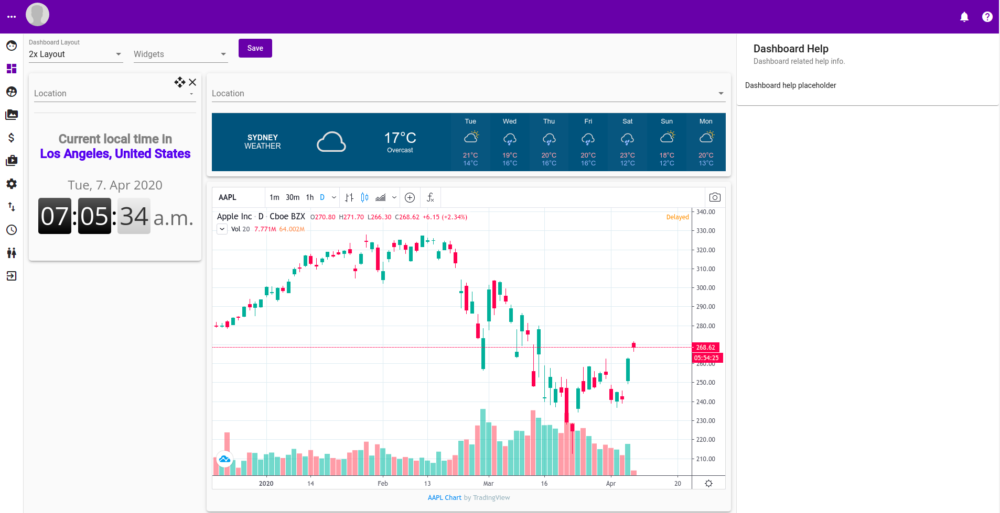

# Help

This is the help section that slides open when the question mark icon in the top right corner is clicked.

## Dashboard

## Profile

## Users, Group and Roles

## Views, Item \(Tabular, Thumbnail, List\), Attributes, Rules and Validation

## Pricing Structure

## Bulk Edit

## Settings

## Import, Export, Custom Import, Custom Export and Export Artifacts

## Jobs

## Partners \( Tabular, List, Thumbnail\)

## Category

