# Import

2 types of imports :

* Build in imports
  * Attributes
  * Items
  * Prices
* Custom imports, needs to be programmatically configured before available for normal user to use. See [here](../../apis/index/get-all-custom-imports.md) for more details on how to sort it out programatically

## Build In Imports

### Attribute Data Format

Following is the data format for attribute import:

The first row in dicates the header of the csv and it **must** exists

| CSV Column | Description |
| :--- | :--- |
| name | Name of the attribute |
| description | Description of the attribute |
| type | Type of attribute, valid values are `string`, `text`, `number`, `date`,  `currency`, `volume` `dimension`, `area`, `width`, `length`, `height`, `height`,`select` or `doubleselect` |
| format | Format of this attribute valid for `number`, `date`, `volume`, `dimension`, `area`, `width`, `length` and `height`. See the code snippet for more info. For numeric atribute types, the format `0.0` means it will be formated in 1 decimal point. For date for mat `DD-MM-YYYY` means \(day- month-year\) format. |
| showCurrencyCountry | Valid for `currency`, attribute type only. To indicate if the country code should be shown |
| pair1 | Valid for `select` and `doubleselect` attribute type only. In the format of pipe \(`|`\) separated`<key1>=<value1>` format, indicating the drop down for first select or doubleselect attribute should have `<value1>` displayed in the drop down corresponding to `<key1>` when it is submitted. |
| pair2 | Valid for `doubleselect` attribute only. In the format of `<key1>=<key2>=<value2>`. Inidicating the if the first drop down has `<key1>` selected, the second drop down shall have an entry with `<value2>` corresponding to `<key2>` when submitted. |

```text
name,description,type,format,showCurrencyCountry,pair1,pair2
att01,att 01 description,string,,,,
att02,att 02 description,text,,,,
att03,att 03 description,number,0.0,,
att04,att 04 description,date,DD/MM/YYYY,,
att05,att 05 description,currency,,true,,
att06,att 06 description,volume,0.0,,,
att07,att 07 description,dimension,0.0,,,
att08,att 08 description,area,0.0,,,
att09,att 09 description,width,0.0,,,
att10,att 10 description,length,0.0,,,
att11,att 11 description,height,0.0,,,
att12,att 12 description,select,,,key1=value1|key2=value2|key3=value3,
att13,att 13 description,doubleselect,,,key1=value1|key2=value2|key3=value3,key1=xkey11=xvalue11|key1=xkey12=xvalue12|key2=xkey21=xvalue21|key2=xkey22=xvalue22|key3=xkey31=xvalue31|key3=xkey32=xvalue32

```

### Item Import Data Format

Item data import can be done in either :

* a csv file alone
* a zipped file with csv file and images \(of the items\)

#### CSV File Alone

Following is the data format for item import:

#### 

The first row in dicates the header of the csv and it **must** exists

| CSV Column | Description |
| :--- | :--- |
| parentName | The parent item name of which this item is a child of. Parent needs to be declared before it's child. |
| name | The name of this item |
| description | The description of this item |
| attName=xxxx | Indicate the value of an attribute. `attName=xxxx` would mean the attribute with name `attName` for this item will have value `xxxx` |
|  |  |

```text
parentName,name,description,attName=att01,attName=att02,attName=att03,attName=att04,attName=att05,attName=att06,attName=att07,attName=att08,attName=att09,attName=att10,attName=att11,attName=att12,attName=att13
,item 1,item 1 description,some string,some text,10.0,10-09-2018,23.50,11.11|l,12.01|13.01|14.01|m,11|m2,33|m,44|m,55|m,key2,key3|xkey31
item 1,item 1_1,item 1_1 description,some string,some text,10.0,10-09-2018,23.50,11.11|l,12.01|13.01|14.01|m,11|m2,33|m,44|m,55|m,key2,key3|xkey31
item 1_1,item 1_1_1,item 1_1_1 description,some string,some text,10.0,10-09-2018,23.50,11.11|l,12.01|13.01|14.01|m,11|m2,33|m,44|m,55|m,key2,key3|xkey31
item 1_1_1,item 1_1_1_1,item 1_1_1_1 description,some string,some text,10.0,10-09-2018,23.50,11.11|l,12.01|13.01|14.01|m,11|m2,33|m,44|m,55|m,key2,key3|xkey31
,item 2,item 2 description,some string,some text,10.0,10-09-2018,23.50,11.11|l,12.01|13.01|14.01|m,11|m2,33|m,44|m,55|m,key2,key3|xkey31
,item 3,item 3 description,some string,some text,10.0,10-09-2018,23.50,11.11|l,12.01|13.01|14.01|m,11|m2,33|m,44|m,55|m,key2,key3|xkey31

```

#### Zip file

If a zip file is to be uploaded, it must be zipped with the following format

```text
+ /root-of-the-zip-file
   - csv-files
   - image files
```

An example would be as follows

```text
$> unzip -l sample-import-items-zip-01.zip 
Archive:  sample-import-items-zip-01.zip
  Length      Date    Time    Name
---------  ---------- -----   ----
        0  2020-06-19 09:43   sample-import-items-zip-01/
     1130  2020-06-19 00:01   sample-import-items-zip-01/sample-import-items-1.csv
        0  2020-06-19 09:48   sample-import-items-zip-01/images/
     6735  2020-06-19 09:48   sample-import-items-zip-01/images/img-03.jpeg
     9052  2020-06-19 09:47   sample-import-items-zip-01/images/img-01.jpeg
    12321  2020-06-19 00:01   sample-import-items-zip-01/images/img-02.jpeg
      782  2020-06-21 21:21   sample-import-items-zip-01/sample-import-items-2.csv
        0  2020-06-19 09:50   sample-import-items-zip-01/images2/
     4645  2020-06-19 09:49   sample-import-items-zip-01/images2/image-02.jpeg
     7306  2020-06-19 09:48   sample-import-items-zip-01/images2/image-01.jpeg
    10792  2020-06-19 09:50   sample-import-items-zip-01/images2/image-03.jpeg
---------                     -------
    52763                     11 files
```

or

```text
$> unzip -l sample-import-items-zip-01.zip 
Archive:  sample-import-items-zip-01.zip
  Length      Date    Time    Name
---------  ---------- -----   ----
        0  2020-06-19 09:48   images/
     6735  2020-06-19 09:48   images/img-03.jpeg
     9052  2020-06-19 09:47   images/img-01.jpeg
    12321  2020-06-19 00:01   images/img-02.jpeg
        0  2020-06-19 09:50   images2/
     4645  2020-06-19 09:49   images2/image-02.jpeg
     7306  2020-06-19 09:48   images2/image-01.jpeg
    10792  2020-06-19 09:50   images2/image-03.jpeg
     1130  2020-06-19 00:01   sample-import-items-1.csv
      782  2020-06-21 21:21   sample-import-items-2.csv
---------                     -------
    52763                     10 files
```

In the case of a zip file format, an extra column in the csv file can be used to indicate the location of the image resources.

```text
parentName,name,description,attName=att01,attName=att02,attName=att03,attName=att04,attName=att05,attName=att06,attName=att07,attName=att08,attName=att09,attName=att10,attName=att11,attName=att12,attName=att13,attName=att14,image
,item 4,item 4 description,some string,some text,10.0,10-09-2018,23.50,11.11|l,12.01|13.01|14.01|m,11|m2,33|m,44|m,55|m,key2,key3|xkey31,10|kg,images/img-01.jpeg
,item 5,item 5 description,some string,some text,10.0,10-09-2018,23.50,11.11|l,12.01|13.01|14.01|m,11|m2,33|m,44|m,55|m,key2,key3|xkey31,10|kg,images/img-02.jpeg|images/img-03.jpeg
,item 6,item 6 description,some string,some text,10.0,10-09-2018,23.50,11.11|l,12.01|13.01|14.01|m,11|m2,33|m,44|m,55|m,key2,key3|xkey31,10|kg,images2/image-01.jpeg|images2/image-02.jpeg|images2/image-03.jpeg
```

In the example above, an extra `image` header was added to the csv header \(the first line\) and in each subsequent line where that header value is located, a `|` separated value can be used to indicate the image locations. The image location has to be from the root of the zipped content. eg `dir1/image-01.jpg|dir2/image02.jpeg` would indicate the following zipped structure

```text
+ <root of zipped content>
   - csv file
   + dir1/
      - image-01.jpg
   + dir2/
      - image02.jpeg
```

### Price Import Data Format

Following is the data format for Price Import:

The first row in dicates the header of the csv and it **must** exists

| CSV Column | Description |
| :--- | :--- |
| addToPricingStructureIfItemNotAlreadyAdded | `true` or `false` to indicate if this pricing do not already exists in the pricing structure, it should be added or not. |
| pricingStructureFormat | Format to find the right pricing structure to insert this pricing into. Eg. `name=PricingStructure1`, will insert this pricing into a pricing structure with name `PricingStructure1`. |
| itemFormat | Format to find the right Item to for this pricing. Eg `name=item1`, will insert this pricing for the item with name `item 1` |
| price | Price value |
| country | Price Country Code |

```text
addToPricingStructureIfItemNotAlreadyAdded,pricingStructureFormat,itemFormat,price,country
true,name=PricingStructure1,name=item 1,20.50,AUD
true,name=PricingStructure1,name=item 1_1,10.10,AUD

```

### Attributes Import

Following is the step by step walk through of an attribute import wizard.

#### Step 1: Select View

Select view to import into.

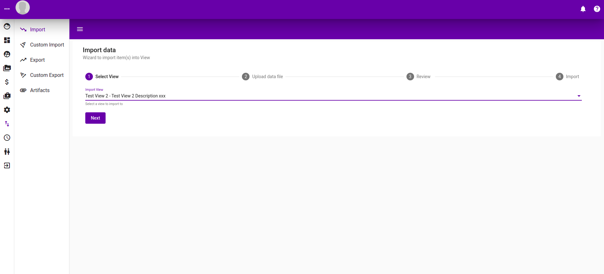

#### 

#### Step 2: Upload Data File

Select an upload file and an upload type, in this case attributes import.

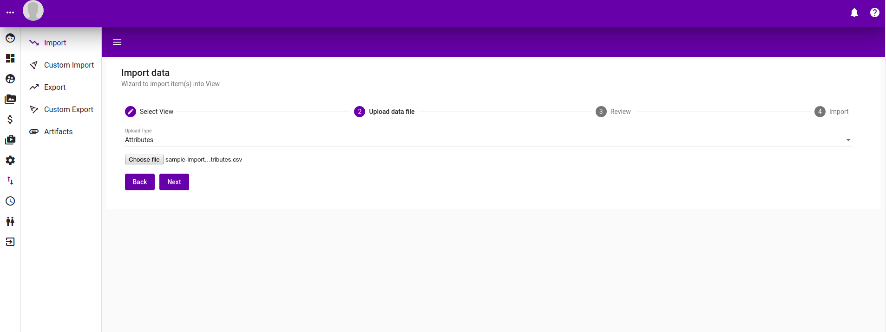

#### Step 3: Preview

A preview of what attributes will be imported.

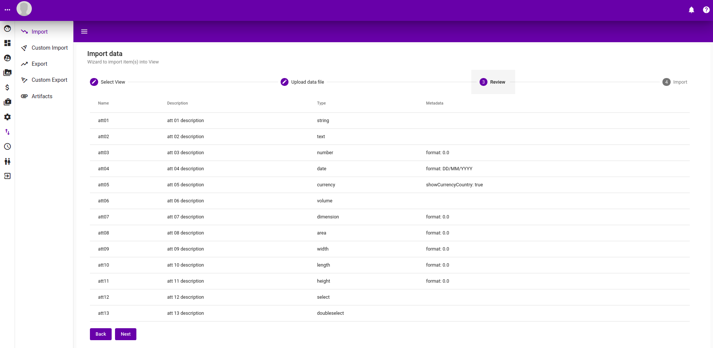

#### Step 4: Run import

Schedule an import, providing the job id that is running the import. The progress and logs of the import can be found in [Job](jobs.md) section

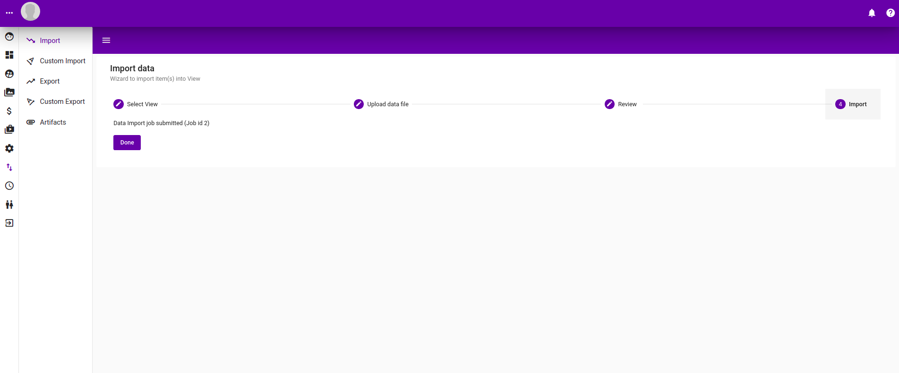

#### Attributes imported into view from previous steps

Following is the page showing attributes imported from the previous steps.

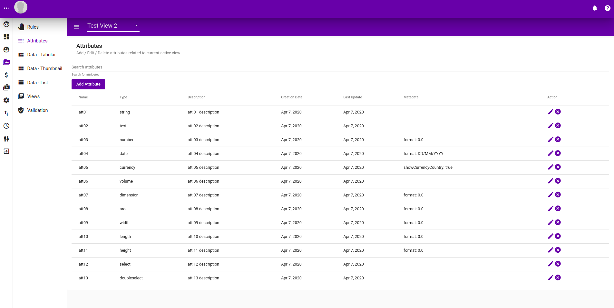

### Items Import

Following is the step by step walk through of an item import wizard.

#### Step 1: Select View

Select the view to import into.


#### Step 2: Upload file

Select the import type, in this case Item import and a csv file with the item data.

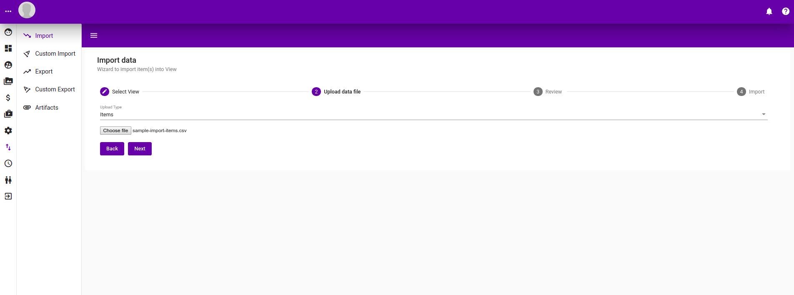

#### Step 3: Preview

A preview of the items to be imported.

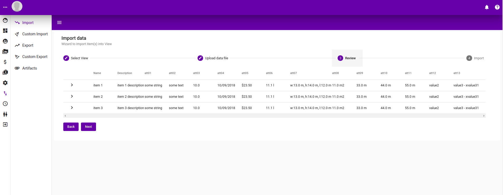

#### Step 4: Schedule import

Schedule item import and show the job number. Details about job and logs can be found in the [job](jobs.md) section.


### Pricing Import

Following is the step by step walk through of a pricing import wizard.

#### Step 1: Select view


#### Step 2: Upload file

Upload a csv file with price import data format and select the price data import type.

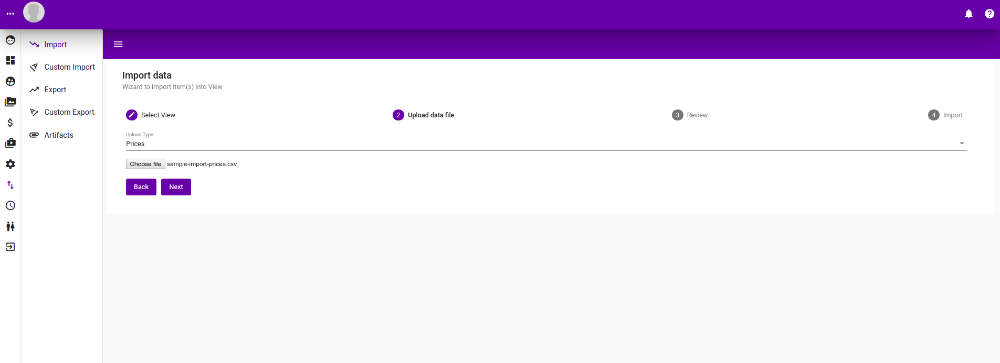

#### Step 3: Preview

Preview of the price to be imported.

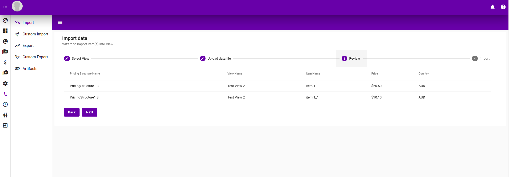

#### Step 4: Schedule import

Schedule an import with the job id of the import job printed. More details about the job can be found [here](jobs.md).

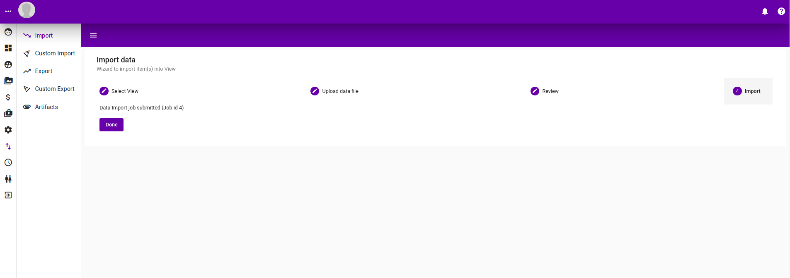

Following is the pricing structure page indicating the prices we just imported above.

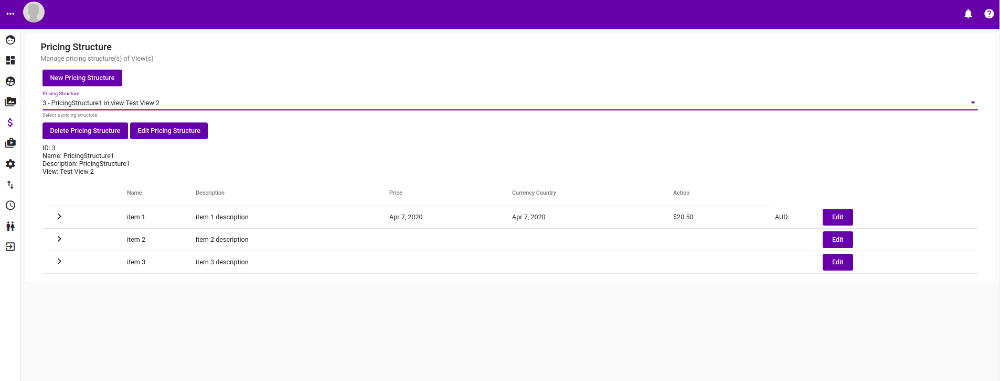

## Custom Imports

Following is the step by step walk through of a typical custom import. Custom import needs to be programmed and configured, for more details see [here](../../developer-guide/untitled/dev-back-end/dev-be-custom-import.md).

#### Step 1: Choose a custom import

Choose from a list of preconfigured custom import. See [here](../../developer-guide/untitled/dev-back-end/dev-be-custom-import.md) for more information on how to do that.

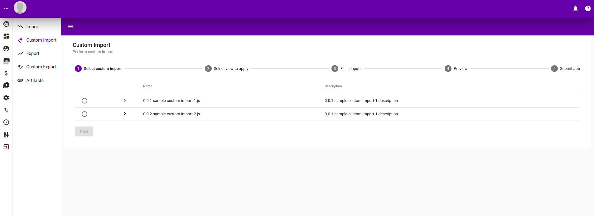

#### Step 2: Choose a view to import into

Select a view for the custom import to import into.


#### Step 3: Filled in custom import information

Filled in the information for custom import. Possible inputs are :-

* String Input Field
* Number Input field
* Checkbox
* Date Input Field
* Select Input Field
* File Upload Input Field

All of them are programmatically scripted and installed. See [here](../../developer-guide/untitled/dev-back-end/dev-be-custom-import.md) for more information.

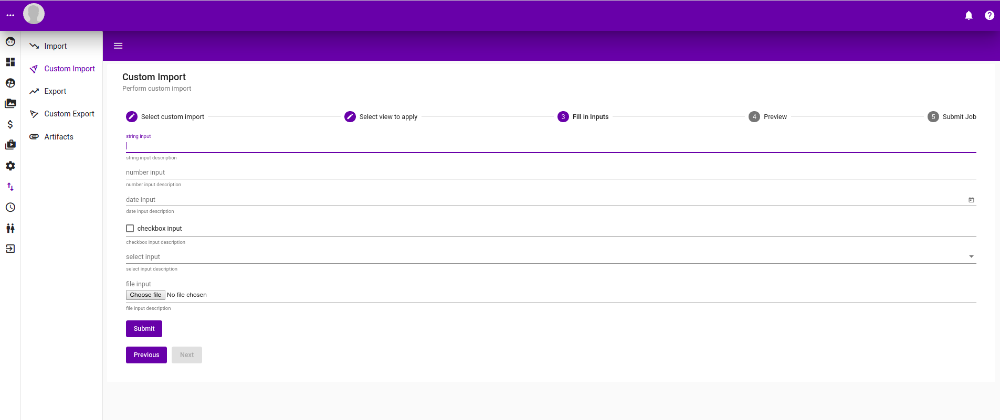

#### Step 4: Preview of custom import

A preview of the custom import in a tabular format.

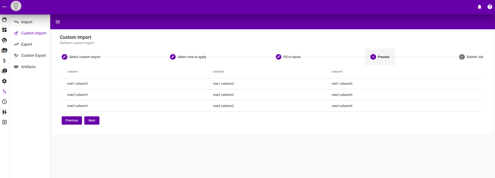

#### Step 5: Schedule custom import

Schedule the import, with job id printed. See [here](jobs.md) for more information about the job.

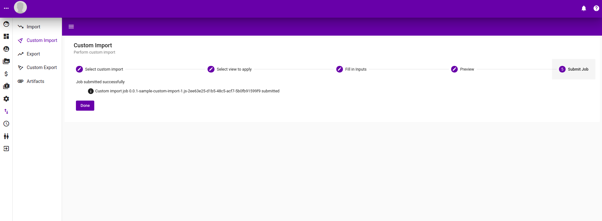

