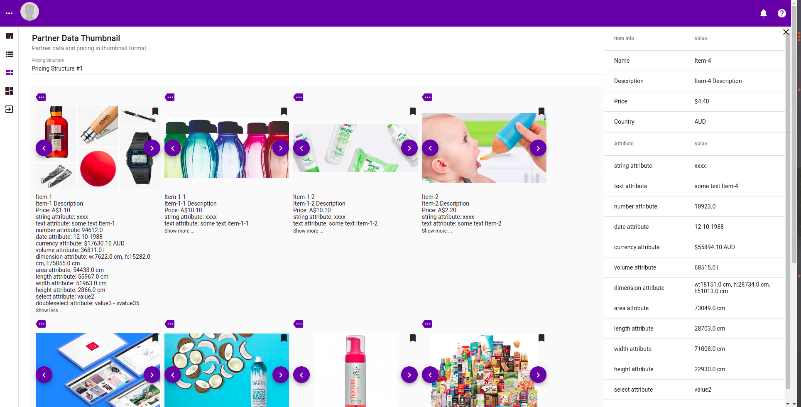
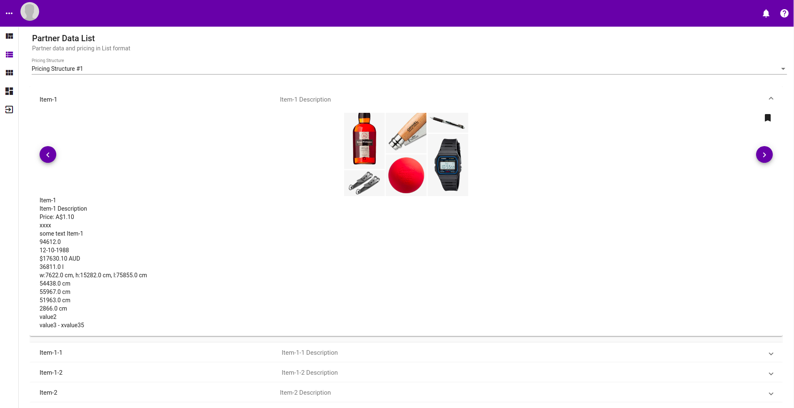

# Partner

To access the Partner page, one needs to be in a group that have PARTNER role. To determine which pricing one can see a mapping between group and pricing structures needs to be done. See [here](pricing-structure.md) for more information about partner association

A pricing structure needs to be selected. The pricing structure one can see depends on the partner association mapping.

## Table view

This is the tabular view of the partner page.

Following is a scrreen shot when a item with children is expanded.

This is when the left most icon is clicked, a side panel would appear indicating all the attributes and item information of that particular row.

## Thumbnail

Click on the thumbnail view on the left side panel. A pricing structure must be selected from the drop down.

Thumbnail view will show the item with it's images as thumbnail and first few of the item information and attributes. 

To see more attributes, click on the expand icon.

Click on the tag like icon at the bottom left of the thumbnail to have a right side panel popup with more information about the item and it's attributes.

## List

Click on the list icon at the very left side menu to show the items in list format. As usual a pricing structure needs to be selected from the drop down first.

Following is a screenshot of the list view.

Following is a screenshot, when an individual item list panel is expanded.

Clicking on the item name would pop up a side panel show more information and attributes of that individual item.

