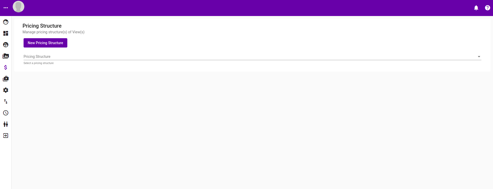
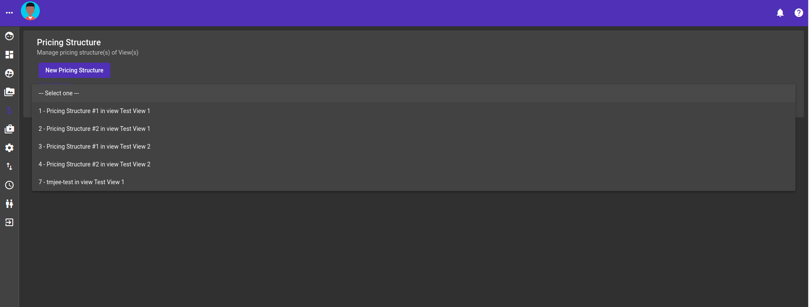
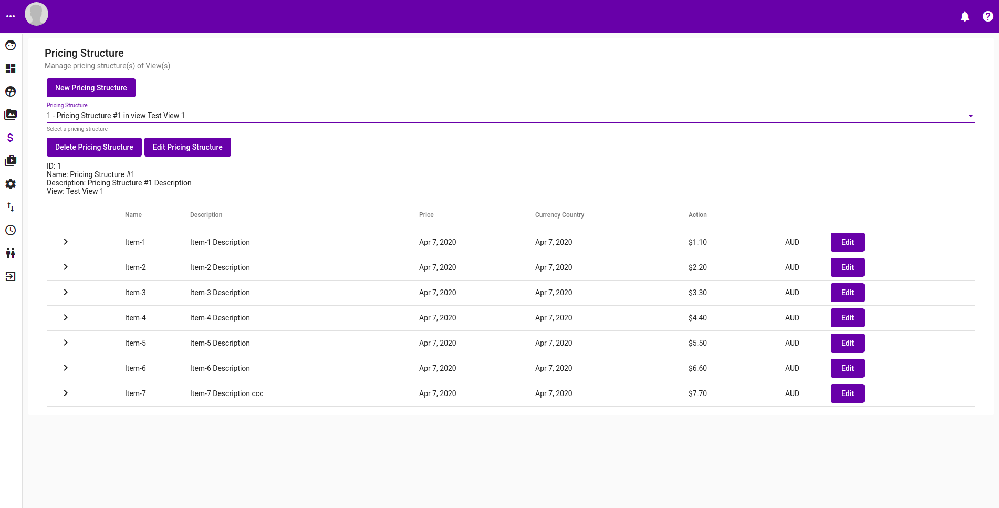
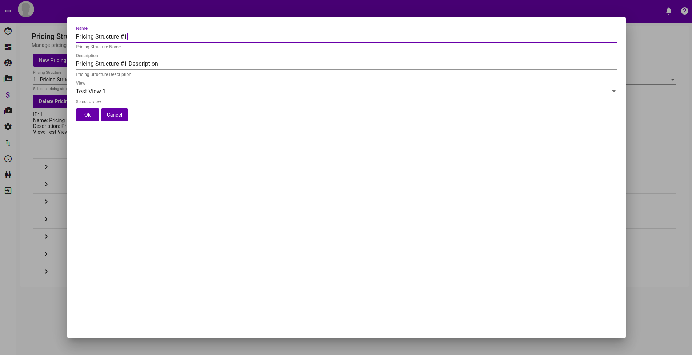
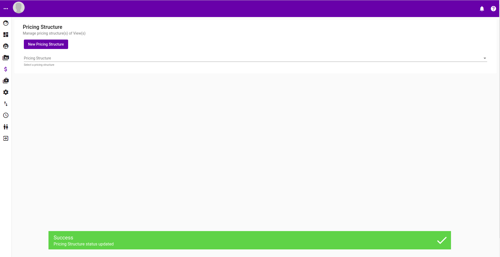
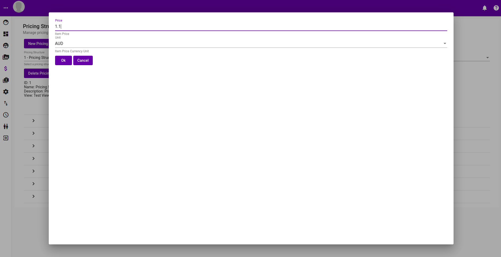
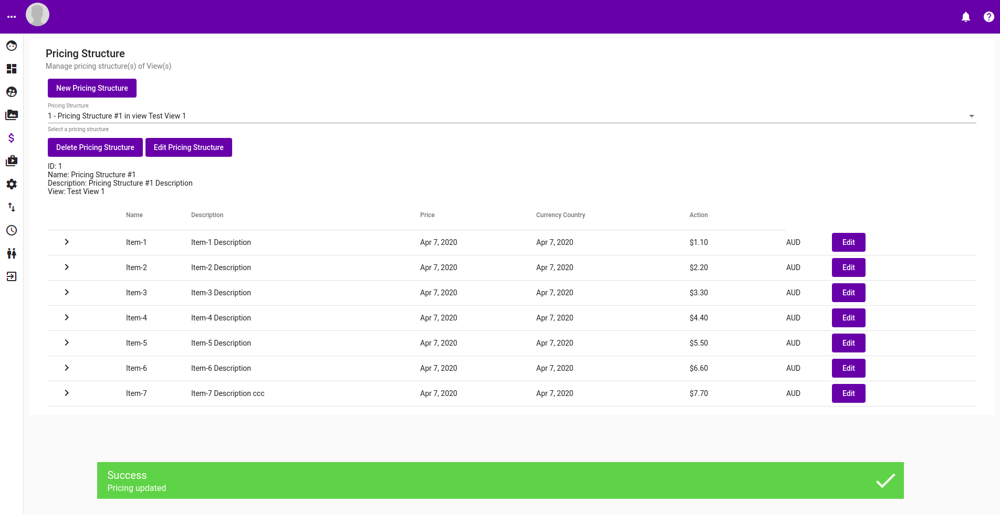
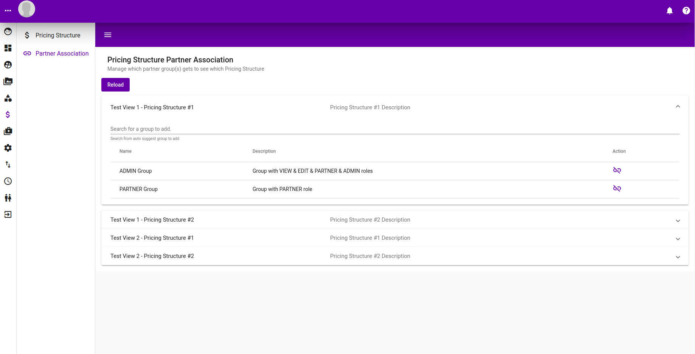

# Pricing Structure

## Listing

To be able to perform operation on a pricing structure, one needs to be selected first from the drop down. Pricing structure is tied to a View.

Upon clicking on the drop down, all available pricing structure should be listed.

## Pricing Listing of a Pricing Structure

Upon selecting a pricing structure, the following screen should be presented. All Items in the view the pricing sturcture is created for will appear. Initially all of them will not have any price.

* Click on the "Delete Pricing Structure" button to delete this pricing structure
* Click on the "New Pricing Structure" button to create a new pricing structure
* Click on the "Edit Pricing Structure" button to edit this pricing structure details \(eg. name, description\)
* Click on the "Edit" button on each item to edit the price of each item

## Editing a Pricing Structure

Upon clicking on the "Edit Pricing Structure" button of an Item \(as shown in screen above\), a popup should present itself allowing details of this Pricing Structure to be edited.

Success message should popup at the bottom when the edit is successfully applied.

## Creating a Pricing Structure

Upon click on the "New Pricing Structure" button in Pricing Structure Listing page, the following popup should appear allowing one to put in details for the new pricing structure to be created.

A green success message box appear if the creation was successful, when "ok" button is clicked.

## Editing Price in a Pricing Structure

Clicking on the "Edit" for an item in Pricing Structure Listing page, the following popup should presents itself allow that item's price to be edited.

A success message should appear if the edit was successful, with the new price appearing in the table.

## Partner Association

Having `PARTNER` role allow you to have access to the partner page. Partner association links a group to a pricing structure in a view, allowing that group to view the pricing structure. In short, to access the partner page one would need `PARTNER` role and a partner association \(associate a `Group` with a `Pricing Structure`\)

