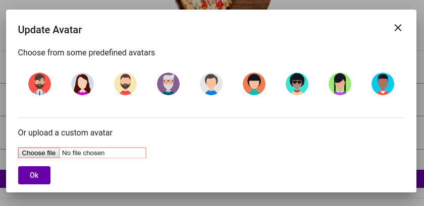
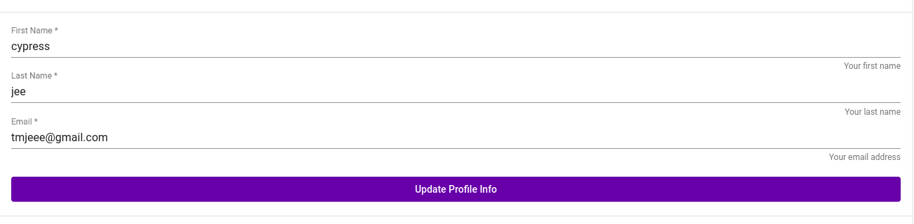
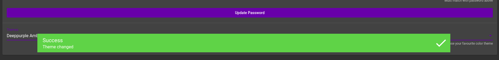

# Profile

The profile page looks somewhat like the following :

This is where a user configure his preferences / details :

* change of avatar
* change of name
* change of email
* change of password
* change of theme

### Change of Avatar

Click on the pencil icon, and a popup will appear allowing you to either 

* Pick from a set of predefined avatars
* Upload an avatar of your fancy

### Change of Name and Email

Simply type in the information you would like to change and click "**Update Profile** Info" button to save your changes.

### Change of Password

To change password, simply type in the new and confirmed password and click "**Update Password**"

### Change of Theme

To change the theme, select a theme from the drop down and see the page transition to the new theme. 


New theme will automatically be saved upon selection.


Upon changing theme a success message will popup

