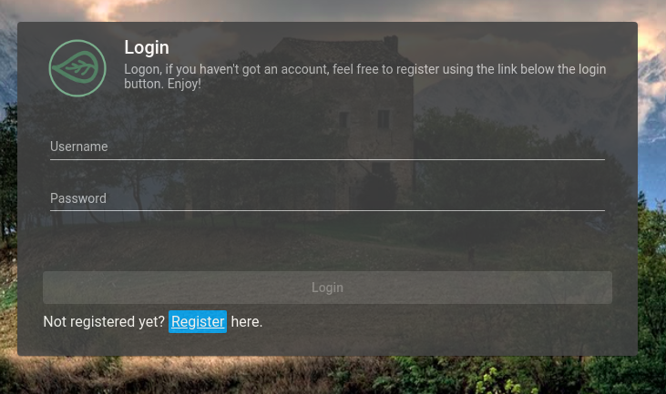

# Registering / Request Access

There are 2 ways a potential user can join the application

## 1\) Self Registration

Through a self registration process, where user visit `http://<host>:<port>/login-layout/register` or through the `register` link in the login page, in order to self register oneself into the application. 

Upon successfull self registration, one would still require activation from another user with `ADMIN` role. See [here](self-registration.md) for more steps regarding self registration

## 2\) Invitation 

This is where an existing user with `ADMIN`role would sent out an email invitation to a not already joined potential user where he would then activate himself through a link provided in the email. 

See [here](invitation-and-activation.md) for more information regarding Invitation and it's activation process.


This would require an smtp server information being configured and set up accordingly. See [here]() for more information regarding installation.


