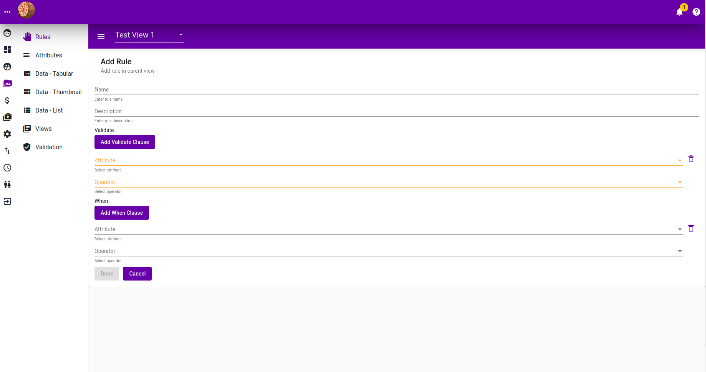
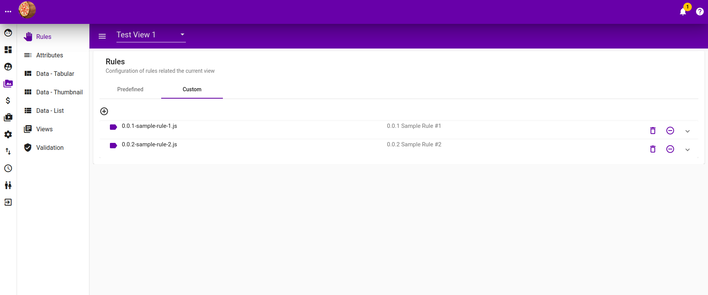
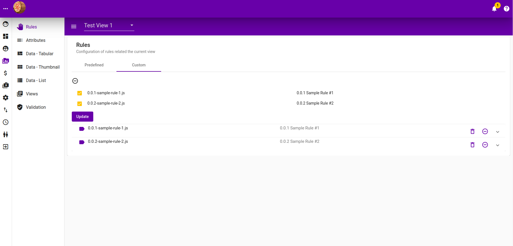

# Rules

**`Rules`** are specific to **`View`**, they validates **`Attributes`** of **`Items`** in that **`View`**. There are 2 kinds of Rules :-

## Build In Rules

These are rules that comes by default with the application.

### Listing

Follwing is the listing of created Built-In Rules. It contains

* **When clause**, indicating when should the validation take place. Muliple when clauses are treated as an AND operator, where all of them need to be valid for validation to take place.
* **Validate clause**, indicate should the **When clause** be true, what attribute is to be validated against and what value should the attribute value be.

### Add Build In Rules

Click "**Add Rule**" button to add new rule. Click "**Add When Clause**" and "**Add Validate Clause**" add **When Clause** and **Validate Clause** respectively.

## Custom Rules

These are rules that can be programmatically plugin as an extension, which then can be applied by users.

### Custom Rules Listing

See [here](../../developer-guide/untitled/dev-back-end/dev-be-custom-rule.md) for more info regarding adding a custom rule.

To remove a custom rule from the view, click on the **"-"** icon on the right side of it.

### Adding Custom Rules to view

To add a custom rule to the current view, click on the **"+"** icon to open up all the available custom rules, and then check on the custom rules accordingly.

