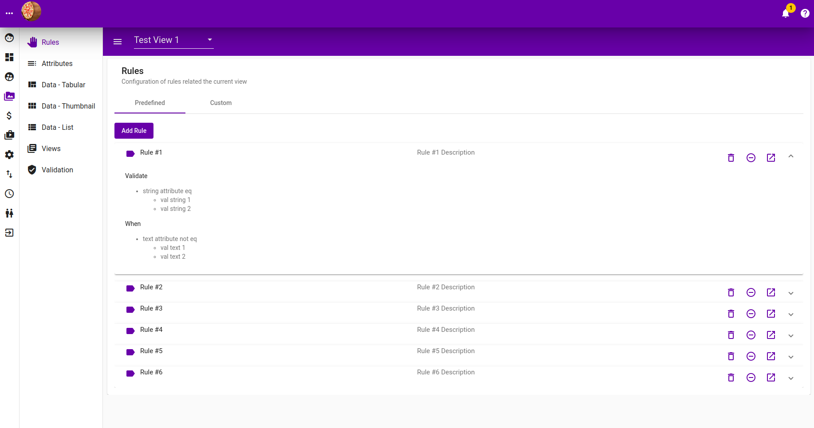

# Rules

**`Rules`** are specific to **`View`**, they validates **`Attributes`** of **`Items`** in that **`View`**. There are 2 kinds of Rules :-

## Build In Rules

These are rules that comes by default with the application.

### Listing

Follwing is the listing of created Built-In Rules. It contains

* **When clause**, indicating when should the validation take place. Muliple when clauses are treated as an AND operator, where all of them need to be valid for validation to take place.
* **Validate clause**, indicate should the **When clause** be true, what attribute is to be validated against and what value should the attribute value be.

### Add Build In Rules

## Custom Rules

These are rules that can be programmatically plugin as an extension, which then can be applied by users.

### Custom Rules Listing

### Adding Custom Rules to view

