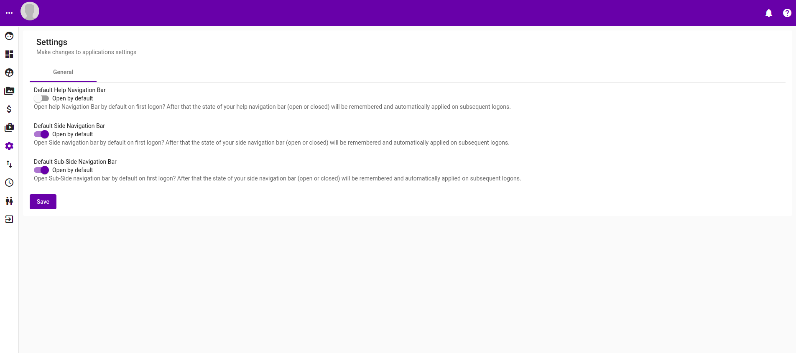

# Settings

Settings page currently allows settings / configurations of the followings :-

| Settings | Description |
| :--- | :--- |
| Help Navigation Bar default default state | Close by default |
| Side Navigation Bar default state | Open by default |
| Sub-Side Navigation Bar default state | Open by default |

Upon successfull saving, a success message should appear.

