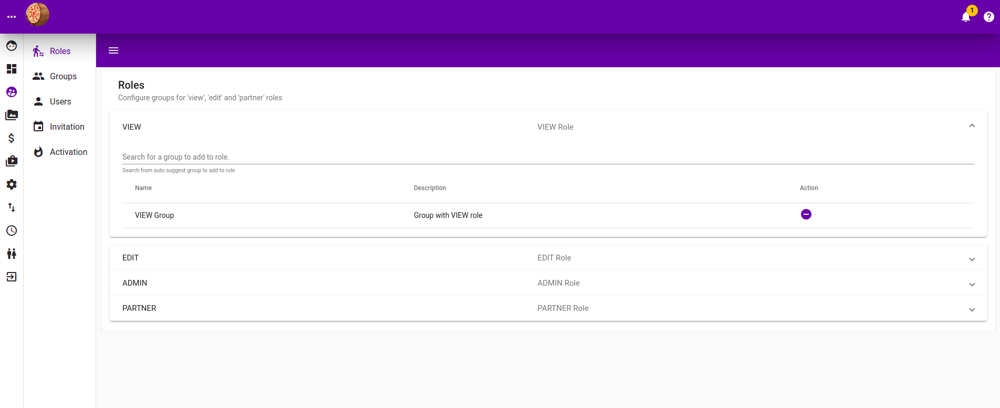
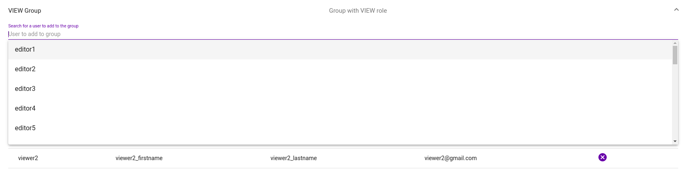

# User Management

`Group`, `User` and `Role`work based on the following concept 

* `Users` belong to a `Group`
* `Group` has `Roles`
* `Roles` control the access / authorisation to the system

In essese, we assign `users` to `groups` and each `group` has roles allowing `users` in that group authorisation.

### Role Management

Following are the predefined `roles` used throughout the system

| Role | Description |
| :--- | :--- |
| VIEW | User with this role can view information in the application |
| EDIT | User with this role can edit information in the application |
| ADMIN | User with this role can perform user, group and role managment |
| PARTNER | User with this role can access partner's pages |

Listed are the `roles`, and you will be able to add `groups` to the respective `role.` Listed in the table are `groups` already have that `role`. You can search for `group` to add in the text box, `group` already have that `role` will not appear.


Start typing in the "**Search for group to add to role**" text box and eligible groups will popup.


### Group Management

This section list the groups availables in sections.

Upon expanding individual group section, you will be able to add **Users** to **Groups**. 


Start typing user's username and and eligible usernames would be populated as drop down for selection.


Eligble usernames start popuping as drop down list when selected.

### Users Management

This section list users that are **Active** and **Inactive**. Users that are **Inactive** are not able to log in.

With the **Active** user section expanded, all of the **Active** users are listed.


Use the "Search users" textbox to search for users. "Search users" textbox is not auto-complete capable, so you would need to press enter for filtering to start.


With in Inactive user section expanded, all of the Inactive users are listed.


"Search users" text box is not auto-complete capable, so you would nee to press endter for filtering to take place.


