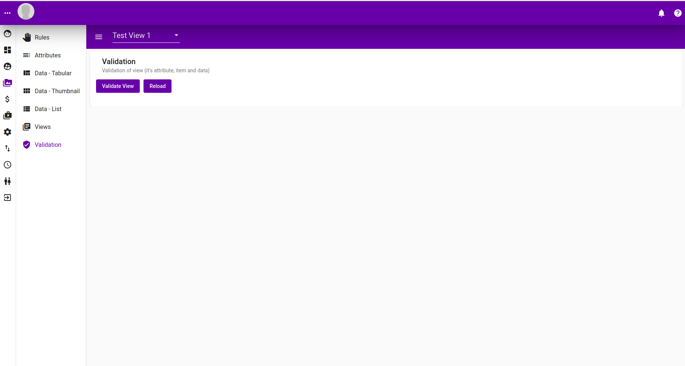
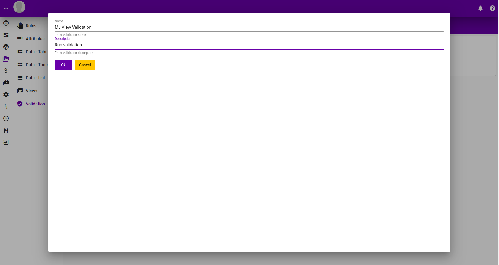
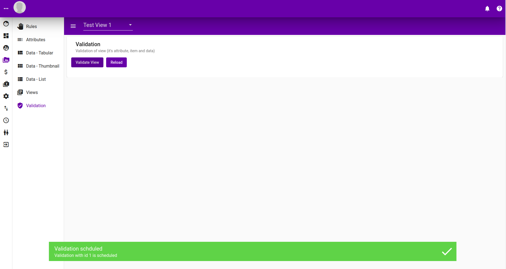
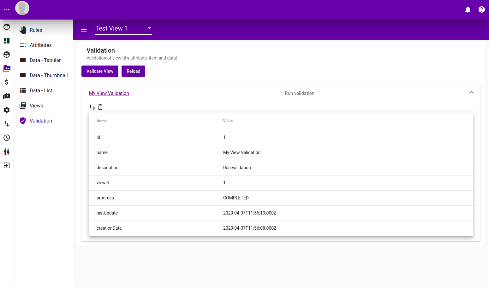
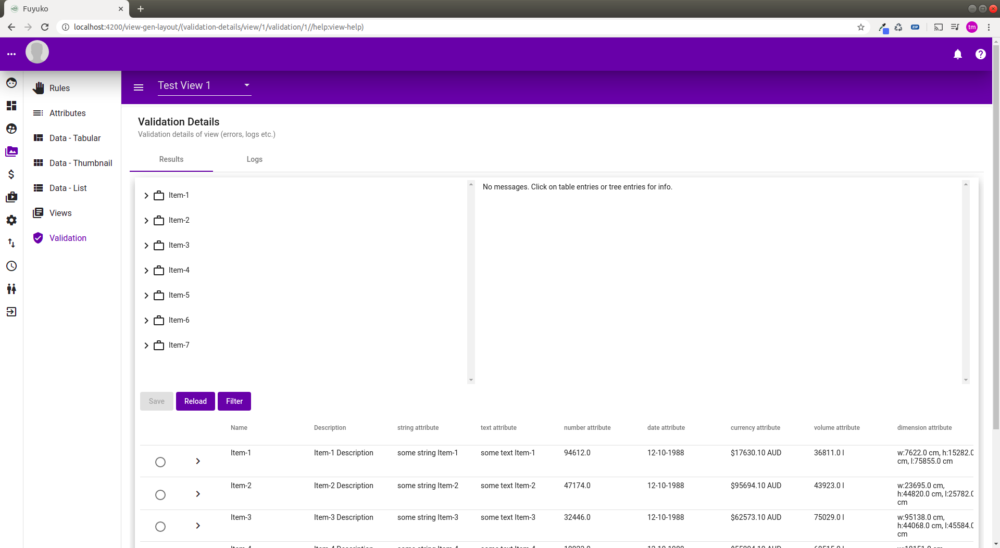
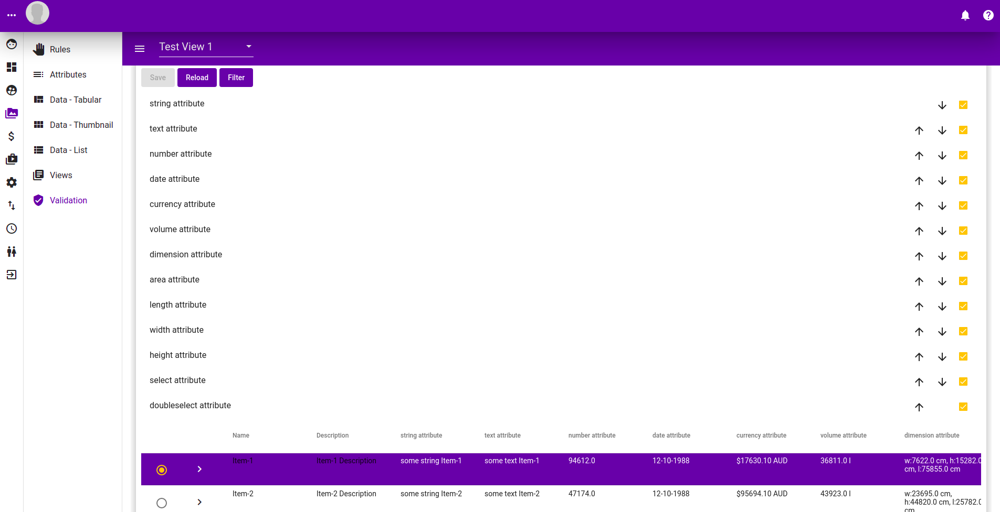
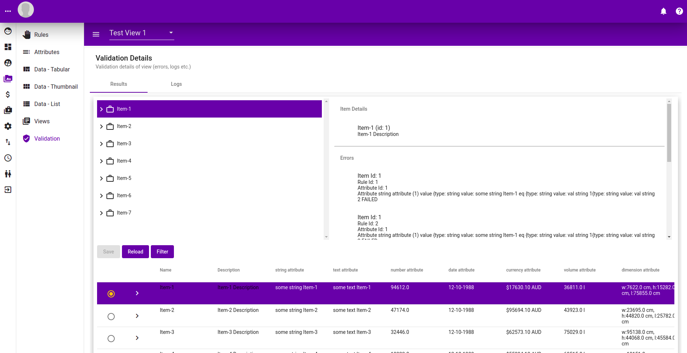
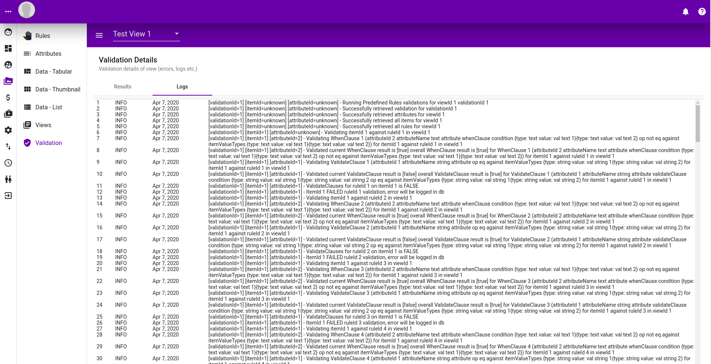

# Validation

## Listing

Following is the listing of all validations ran, right now it is empty.

## Creating and Scheduling a validation

### Creating a Validation

To run a validation click "Validate View" button. A popup should present itself.

### Scheduling a validation

After submitting the form above, the validation will be scheduled.

#### 

## Validation Run Result

### Validation Result

### Validation Result Details

#### Main

#### Filtering

#### Selection

#### Logs

