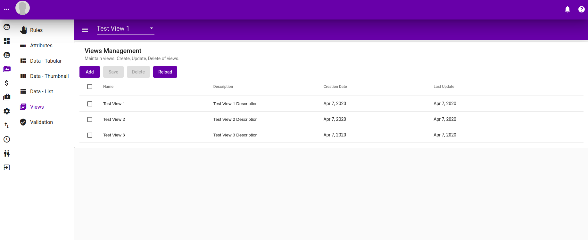

# View


Changes done to view will not be persisted until the "Save" button is pressed. Rember to click "Save" in order to persist changes.


## Listing

Listing of views.

## Adding New View

Clicking on "Add" button will popup the following dialog.

## Editing Existing View Name

Clicking on existing view name will popup a dialog allowing it to be edited.

## Editing Existing View Description

Clicking on an existing view description will popup a dialog allowing it to be edited.

## Selecting View

To delete multiple views, select them throught their checkboxes and then click the "Delete" button.

## Reloading 

To reload the data, click on "Reload" button

