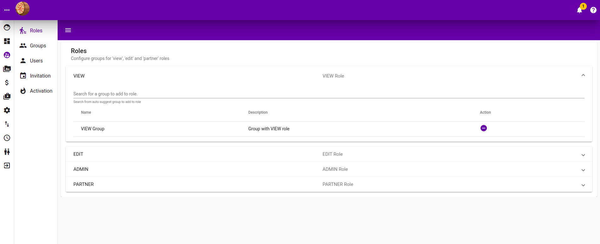
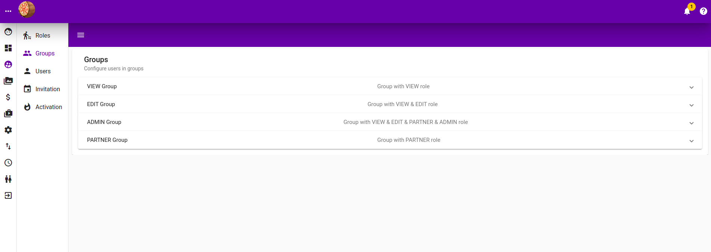
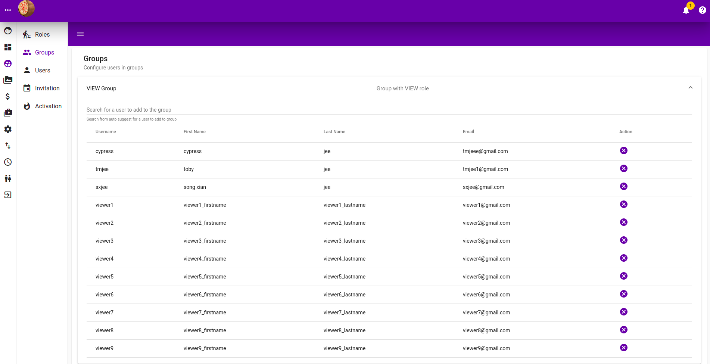
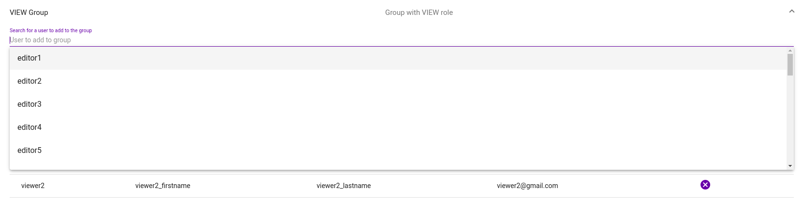

# User Management

`Group`, `User` and `Role`work based on the following concept 

* `Users` belong to a `Group`
* `Group` has `Roles`
* `Roles` control the access / authorisation to the system

### 

In essese, we assign `users` to `groups` and each `group` has roles allowing `users` in that group authorisation.

### Role Management

Following are the predefined `roles` used throughout the system

| Role | Description |
| :--- | :--- |
| VIEW |  |
| EDIT |  |
| ADMIN |  |
| PARTNER |  |

Listed are the `roles`, and you will be able to add `groups` to the respective `role.` Listed in the table are `groups` already have that `role`. You can search for `group` to add in the text box, `group` already have that `role` will not appear.

### Group Management

### Users Management

